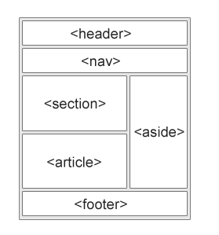
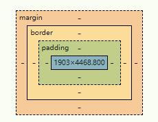

- HTML
	- 1.HTML basic
	  collapsed:: true
		- 基本框架
		  collapsed:: true
			- ```html
			  <!DOCTYPE html>
			  <html>
			  <body>
			  
			  <h1>My First Heading</h1>
			  <p>My first paragraph.</p>
			  
			  </body>
			  </html>
			  ```
		- 标题
		  collapsed:: true
			- ```html
			  <h1>This is heading 1</h1>
			  <h2>This is heading 2</h2>
			  <h3>This is heading 3</h3>
			  <h4>This is heading 4</h4>
			  <h5>This is heading 5</h5>
			  <h6>This is heading 6</h6>
			  ```
		- 段落
		  collapsed:: true
			- ```html
			  <p>This is a paragraph.</p>
			  <p>This is another paragraph.</p>
			  ```
		- 链接
		  collapsed:: true
			- ```html
			  <a href="https://www.w3schools.com">This is a link</a>
			  ```
		- 图像
		  collapsed:: true
			- ```html
			  
			  ```
		- ...
	- 2.HTML Forms
	  collapsed:: true
		- ```html
		  <!-- 基础input标签 -->
		  <input type="text">
		  <input type="radio">
		  <input type="checkbox">
		  <input type="submit">
		  <input type="button">
		  <!-- 属性 -->
		  <form action="/action_page.php" target="_blank">
		  <form action="/action_page.php" method="get">
		  <form action="/action_page.php" autocomplete="on">
		  <form action="/action_page.php" novalidate>
		  <!-- form 元素 -->
		  <label for="idname">xxx</label>
		  <input type="text" id="idname" name="fname">
		    
		  <label for="cars">Choose a car:</label>
		  <select id="cars" name="cars">
		    <option value="volvo">Volvo</option>
		    <option value="saab">Saab</option>
		    <option value="fiat">Fiat</option>
		    <option value="audi">Audi</option>
		  </select>
		    
		  <textarea name="message" rows="10" cols="30">
		  The cat was playing in the garden.
		  </textarea>
		  
		  <button type="button" onclick="alert('Hello World!')">Click Me!</button>
		  
		  <form action="/action_page.php">
		    <fieldset>
		      <legend>Personalia:</legend>
		      <label for="fname">First name:</label><br>
		      <input type="text" id="fname" name="fname" value="John"><br>
		      <label for="lname">Last name:</label><br>
		      <input type="text" id="lname" name="lname" value="Doe"><br><br>
		      <input type="submit" value="Submit">
		    </fieldset>
		  </form>
		    
		  <form action="/action_page.php">
		    <input list="browsers">
		    <datalist id="browsers">
		      <option value="Edge">
		      <option value="Firefox">
		      <option value="Chrome">
		      <option value="Opera">
		      <option value="Safari">
		    </datalist>
		  </form>  
		    
		  <!-- HTML Input Types-->
		  <input type="button">
		  <input type="checkbox">
		  <input type="color">
		  <input type="date">
		  <input type="datetime-local">
		  <input type="email">
		  <input type="file">
		  <input type="hidden">
		  <input type="image">
		  <input type="month">
		  <input type="number">
		  <input type="password">
		  <input type="radio">
		  <input type="range">
		  <input type="reset">
		  <input type="search">
		  <input type="submit">
		  <input type="tel">
		  <input type="text">
		  <input type="time">
		  <input type="url">
		  <input type="week">
		  ```
	- 3.HTML Semantics
	  collapsed:: true
		- 非语义
			- `<div>` + `span`
		- 语义
			- `<form>` 、 `<table>` 和 `<article>`
		- 
			- section
				- 节
			- article
				- 独立，自包含的内容
			- aside
				- 所在内容之外的内容（比如侧边栏）
- CSS
	- 1.CSS basic
	  collapsed:: true
		- 基础语法
		  collapsed:: true
			- ```css
			  h1 {color:blue;}
			  ```
		- 选择器
		  collapsed:: true
			- 元素选择器
				- `p {color:red;}`
			- ID选择器
				- `#idname {text-align:center;}`
			- CLASS选择器
				- `.classname {float:left;}`
			- 通用选择器
				- `* {color:blue;}`
			- 分组选择器
				- `h1, h2, p {color:green;}`
		- 添加CSS
		  collapsed:: true
			- 优先级
				- Inline CSS > External and internal style sheets (in the head section) > Browser default
			- ```css
			  /* External CSS */
			  <link rel="stylesheet" href="mystyle.css">
			  /* Internal CSS */
			  <style>
			  h1 {
			    color: maroon;
			    margin-left: 40px;
			  }
			  </style>
			  /* Inline CSS */
			  <h1 style="color:blue;text-align:center;">This is a heading</h1>
			  ```
		- CSS 注释
		  collapsed:: true
			- `/* This is a single-line comment */`
		- CSS 颜色
		  collapsed:: true
			- RGB
				- `rgb(255, 99, 71)`
			- HEX
				- `#ffffff`
			- HSL
				- `hsl(9, 100%, 64%)`
		- CSS 背景
		  collapsed:: true
			- ```css
			  body {
			    background-color: #ffffff;
			    background-image: url("img_tree.png");
			    background-repeat: no-repeat;
			    background-position: right top;
			  }
			  
			  body {
			    background: #ffffff url("img_tree.png") no-repeat right top;
			  }
			  ```
		- `CSS 盒子模型`
		  collapsed:: true
			- 
		- `CSS 布局`
		  collapsed:: true
			- position
			  collapsed:: true
				- static
					- 默认定位
					- 不受top、bottom、left、right属性影响
				- relative
				  collapsed:: true
					- 相对于其正常位置定位
					- top、right、bottom 和 left 属性将导致其调整远离其正常位置
				- fixed
				  collapsed:: true
					- 相对于视口定位
				- absolute
				  collapsed:: true
					- 相对于最近的定位祖先定位
					- 如果绝对定位的元素没有定位的祖先，则它使用文档主体，并随着页面滚动而移动
					- 绝对定位的元素将从正常流中删除，并且可以重叠元素
				- sticky
				  collapsed:: true
					- 根据用户的滚动位置进行定位
			- float and clear
				- left
					- 元素浮动到其容器的左侧
				- right
					- 元素浮动到其容器的右侧
				- none
					- 元素不浮动
				- inherit
					- 元素继承其父元素的浮点值
				- `clear: both;`
		- CSS 组合器
		  collapsed:: true
			- 空格
				- 后代组合器
			- >
				- 子组合器
			- +
				- 下一个同级组合器（一个）
			- ~
				- 后续兄弟组合器（多）
		- CSS 伪类
		  collapsed:: true
			- 用来定义元素特殊状态
			- ```css
			  /* unvisited link */
			  a:link {
			    color: #FF0000;
			  }
			  /* visited link */
			  a:visited {
			    color: #00FF00;
			  }
			  /* mouse over link */
			  a:hover {
			    color: #FF00FF;
			  }
			  /* selected link */
			  a:active {
			    color: #0000FF;
			  }
			  /*first-child*/
			  p:first-child {
			    color: blue;
			  }
			  
			  ```
		- CSS 伪元素
		  collapsed:: true
			- 伪元素用于设置元素特定部分的样式
		- CSS 单位
		  collapsed:: true
			- px、em、vh、vw
		- CSS 特异性
		  collapsed:: true
			- 如果有两个或多个 CSS 规则指向同一元素，则具有最高特异性的选择器将“获胜”，并且其样式声明将应用于该 HTML 元素
			- 优先级
				- 内联 > ID > class 和伪类 > 属性 > 元素或伪元素
				- 同等特异性：最新规则获胜
			-
		- !important
		  collapsed:: true
			- 覆盖该元素上该特定属性的所有先前样式规则
	- `2.响应式网站设计`
	  collapsed:: true
		- 使用 CSS 和 HTML 来调整、隐藏、缩小、放大或移动内容以使其在任何屏幕上看起来都不错
		- 1.The Viewport
		  collapsed:: true
			- 视口
			  collapsed:: true
				- 网页用户可见区域
				- 视口因设备而异，并且在手机上会比在计算机屏幕上小
				- width=device-width
					- 页面的宽度以遵循设备的屏幕宽度
				- initial-scale=1.0
					- 浏览器首次加载页面时的初始缩放级别
				- `<meta name="viewport" content="width=device-width, initial-scale=1.0" />`
		- 2.网格视图
		  collapsed:: true
			- 响应式网格视图通常有 12 列，总宽度为 100%
			- 并且会随着您调整浏览器窗口的大小而缩小和扩展
			- ```css
			  /*1.首先确保所有 HTML 元素的 `box-sizing` 属性设置为 `border-box`*/
			  * { box-sizing: border-box;}
			  /*2.所有这些列都应向左浮动，并具有 15px 的填充*/
			  [class*="col-"] {
			    float: left;
			    padding: 15px;
			  }
			  /*行内的列全部向左浮动，因此被排除在页面的流程之外，并且其他元素将被放置，就好像这些列不存在一样。为了防止这种情况，我们将添加一个清除流程的样式*/
			  .row::after {
			    content: "";
			    clear: both;
			    display: table;
			  }
			  
			  ```
		- 3.媒体查询
			- 仅当某个条件为真时，它才使用 `@media` 规则包含 CSS 属性块
			- ```css
			  @media only screen and (max-width: 600px) {
			    body {
			      background-color: lightblue;
			    }
			  }
			  ```
			- 添加断点
			- ```css
			  /* For desktop: */
			  .col-1 {width: 8.33%;}
			  .col-2 {width: 16.66%;}
			  .col-3 {width: 25%;}
			  .col-4 {width: 33.33%;}
			  .col-5 {width: 41.66%;}
			  .col-6 {width: 50%;}
			  .col-7 {width: 58.33%;}
			  .col-8 {width: 66.66%;}
			  .col-9 {width: 75%;}
			  .col-10 {width: 83.33%;}
			  .col-11 {width: 91.66%;}
			  .col-12 {width: 100%;}
			  
			  @media only screen and (max-width: 768px) {
			    /* For mobile phones: */
			    [class*="col-"] {
			      width: 100%;
			    }
			  }
			  ```
			- 无论如何移动设备为先，所以上面的修改
			- ```css
			  /* For mobile phones: */
			  [class*="col-"] {
			    width: 100%;
			  }
			  
			  @media only screen and (min-width: 768px) {
			    /* For desktop: */
			    .col-1 {width: 8.33%;}
			    .col-2 {width: 16.66%;}
			    .col-3 {width: 25%;}
			    .col-4 {width: 33.33%;}
			    .col-5 {width: 41.66%;}
			    .col-6 {width: 50%;}
			    .col-7 {width: 58.33%;}
			    .col-8 {width: 66.66%;}
			    .col-9 {width: 75%;}
			    .col-10 {width: 83.33%;}
			    .col-11 {width: 91.66%;}
			    .col-12 {width: 100%;}
			  }
			  ```
			- 添加任意多断点
			- ```css
			  /* For mobile phones: */
			  [class*="col-"] {
			    width: 100%;
			  }
			  
			  @media only screen and (min-width: 600px) {
			    /* For tablets: */
			    .col-s-1 {width: 8.33%;}
			    .col-s-2 {width: 16.66%;}
			    .col-s-3 {width: 25%;}
			    .col-s-4 {width: 33.33%;}
			    .col-s-5 {width: 41.66%;}
			    .col-s-6 {width: 50%;}
			    .col-s-7 {width: 58.33%;}
			    .col-s-8 {width: 66.66%;}
			    .col-s-9 {width: 75%;}
			    .col-s-10 {width: 83.33%;}
			    .col-s-11 {width: 91.66%;}
			    .col-s-12 {width: 100%;}
			  }
			  
			  @media only screen and (min-width: 768px) {
			    /* For desktop: */
			    .col-1 {width: 8.33%;}
			    .col-2 {width: 16.66%;}
			    .col-3 {width: 25%;}
			    .col-4 {width: 33.33%;}
			    .col-5 {width: 41.66%;}
			    .col-6 {width: 50%;}
			    .col-7 {width: 58.33%;}
			    .col-8 {width: 66.66%;}
			    .col-9 {width: 75%;}
			    .col-10 {width: 83.33%;}
			    .col-11 {width: 91.66%;}
			    .col-12 {width: 100%;}
			  }
			  ```
			- html example
			- ```html
			  <div class="row">
			    <div class="col-3 col-s-3">...</div>
			    <div class="col-6 col-s-9">...</div>
			    <div class="col-3 col-s-12">...</div>
			  </div>
			  ```
			- 典型设备断点
			- ```css
			  /* Extra small devices (phones, 600px and down) */
			  @media only screen and (max-width: 600px) {...}
			  /* Small devices (portrait tablets and large phones, 600px and up) */
			  @media only screen and (min-width: 600px) {...}
			  /* Medium devices (landscape tablets, 768px and up) */
			  @media only screen and (min-width: 768px) {...}
			  /* Large devices (laptops/desktops, 992px and up) */
			  @media only screen and (min-width: 992px) {...}
			  /* Extra large devices (large laptops and desktops, 1200px and up) */
			  @media only screen and (min-width: 1200px) {...}
			  ```
	- `3.CSS Flexbox`
	  collapsed:: true
		- 定义
		  collapsed:: true
			- 是一种用于按行或列排列项目的布局方法
			- 可以更轻松地设计灵活的响应式布局结构，而无需使用浮动或定位
		- 传统布局
		  collapsed:: true
			- block：用于网页中节
			- inline：用于文本
			- table：用于二维表格数据
			- positioned：用于元素的明确定位
		- 基础组件
		  collapsed:: true
			- Container 容器
			- Items 项目
		- 使用方式
		  collapsed:: true
			- 1.定义一个Flex容器
			  collapsed:: true
				- `display:flex`
				- 用于Flex容器的CSS属性是
					- `flex-direction`
					  collapsed:: true
						- 指定 Flex 容器中 Flex 项目的显示方向
						- row：水平显示（从左往右）
						- row-reverse ：水平显示（从右往左）
						- column : 垂直显示（从上到下）
						- column-reverse：垂直显示（从下到上）
					- `flex-wrap`
					  collapsed:: true
						- 如果一条 Flex 线上没有足够的空间容纳 Flex 项目，它们是否应该换行
						- nowrap ： 指定弹性项目不会换行
						- wrap ： 在必要的时候换行
						- wrap-reverse ：在必要的时候相反顺序换行
					- `flex-flow`
					  collapsed:: true
						- `flex-direction` 和 `flex-wrap` 属性的简写属性
						- ```css
						  .flex-container {
						    display: flex;
						    flex-flow: row wrap;
						  }
						  ```
					- `justify-content`
					  collapsed:: true
						- 在 Flex 项目未使用主轴（水平）上的所有可用空间时对齐 Flex 项目
						- `center` 值将弹性项目定位在容器的中心
						- `flex-start` 值将弹性项目定位在容器的开头（这是默认值）
						- `flex-end` 值将弹性项目定位在容器的末尾
						- `space-around` 值显示 Flex 项目，周围有空间
						- `space-between` 值显示弹性项目，它们之间有空格
						- `space-evenly` 值以周围相等的空间显示弹性项目：
					- `align-items`
					  collapsed:: true
						- `align-items` 属性用于在 Flex 项目未使用横轴（垂直）上的所有可用空间时对齐 Flex 项目
						- `center` 值将弹性项目定位在容器的中间
						- `flex-start` 值将弹性项目定位在容器的顶部
						- `flex-end` 值将弹性项目定位在容器的底部
						- `stretch` 值拉伸弹性项目以填充容器（这等于默认的“正常”）
						- `baseline` 值将弹性项目定位在容器的基线处
					- `align-content`
					  collapsed:: true
						- 用于对齐伸缩线
						- `align-content` 属性与 `align-items` 类似，但它不是对齐 Flex 项目，而是对齐 Flex 线
						- `center` ，伸缩线会朝容器的中心排列
						- `stretch` ，伸缩线会拉伸以占据容器的剩余空间（这是默认值）
						- `flex-start` ，伸缩线会朝容器的开头排列
						- `flex-end` ，伸缩线会朝容器的末端排列
						- `space-between` ，伸缩线之间的间距相等，但第一个项目与容器的起始边缘齐平，最后一个项目与容器的结束边缘齐平
						- `space-around` ，伸缩线之间的间距相等，但第一个项目之前和最后一个项目之后的间距设置为伸缩线之间间距的一半
						- `space-evenly` 时，伸缩线均匀分布在伸缩容器中，顶部、底部和之间的空间相等
						-
			- 2.完美居中方案
			  collapsed:: true
				- ```css
				  .flex-container {
				    display: flex;
				    height: 300px;
				    justify-content: center;
				    align-items: center;
				  }
				  ```
			- 3.Flex Items
			  collapsed:: true
				- Flex容器直接子元素自动成为Flex项目
				- 用于Flex项目的css属性
					- `order` 属性指定 Flex 容器内 Flex 项目的顺序
					- `flex-grow` 属性指定 Flex 项目相对于其余 Flex 项目的增长量
					- `flex-shrink` 属性指定 Flex 项目相对于其余 Flex 项目收缩的程度
					- `flex-basis` 属性指定 Flex 项目的初始长度
					- `flex` 属性是 `flex-grow` 、 `flex-shrink` 和 `flex-basis` 属性的简写属性
						- ```css
						  flex: 0 0 200px	
						  ```
					- `align-self` 属性指定灵活容器内所选项目的对齐方式
						- ```css
						  align-self: center
						  align-self: flex-start
						  align-self: flex-end
						  ```
			- 4.响应式Flexbox
			  collapsed:: true
				- ```css
				  .row {
				    display: flex;
				    flex-wrap: wrap;
				    padding: 0 4px;
				  }
				  /* Create four equal columns that sits next to each other */
				  .column {
				    flex: 25%;
				    max-width: 25%;
				    padding: 0 4px;
				  }
				  .column img {
				    margin-top: 8px;
				    vertical-align: middle;
				  }
				  /* Responsive layout - makes a two column-layout instead of four columns */
				  @media (max-width: 800px) {
				    .column {
				      flex: 50%;
				      max-width: 50%;
				    }
				  }
				  /* Responsive layout - makes the two columns stack on top of each other instead of next to each other */
				  @media (max-width: 600px) {
				    .column {
				      flex: 100%;
				      max-width: 100%;
				    }
				  }
				  ```
	- 4.CSS Grid
	  collapsed:: true
		- 定义
			- 网格布局模块提供基于网格的布局系统，具有行和列
			- 二维布局
		- 使用
			- 1.当 HTML 元素的 `display` 属性设置为 `grid` 或 `inline-grid` 时，它就成为网格容器
			- 2.网格容器的组成
				- 1.网格项的垂直线称为列 *columns*
				- 2.网格项的水平线称为行 *rows*
				- 3.每列/行之间的空间称为间隙 *gaps*
			- 3.间隙大小调整
				- `column-gap` 属性指定网格中列之间的间隙
				- `row-gap` 属性指定网格中行之间的间隙
				- `gap` 属性是 `row-gap` 和 `column-gap` 的简写属性
				  collapsed:: true
					- ```css
					  .container {
					    display: grid;
					    gap: 50px 100px;
					  }
					  ```
				- Grid Lines 网格线
				  collapsed:: true
					- 列之间的线称为列线   *column lines*
					- 行之间的线称为行线   *row lines*
					- ```css
					  /*将网格项放置在列线 1 处，并让它在列线 3 处结束*/
					  .item1 {
					    grid-column-start: 1;
					    grid-column-end: 3;
					  }
					  ```
				- Grid Container   网格容器
				  collapsed:: true
					- Grid Tracks   网格轨道
					  collapsed:: true
						- 网格的行和列由 `grid-template-rows` 和 `grid-template-columns` 属性（或简写 `grid` 或 `grid-template` 属性）定义
						- `grid-template-columns`
							- 属性定义网格布局中的列数，并且可以定义每列的宽度
							- `grid-template-columns: auto auto auto auto;`
							- `grid-template-columns: 80px 200px auto 40px;`
						- `grid-template-rows`
							- 属性定义每行的高度
							- `grid-template-rows: 80px 200px;`
						-
					- `justify-content` 属性用于对齐容器内的整个网格
					- `align-content`      属性用于垂直对齐容器内的整个网格
					- `place-content` 属性是 `align-content` 和 `justify-content` 属性的简写属性
						- ```css
						  .grid-container {
						    display: grid;
						    height: 400px;
						    place-content: center center;
						  }
						  ```
				- Grid Items   网格项目
					- `grid-column` 属性定义要在哪一列上放置项目
					  collapsed:: true
						- ```css
						  /*使“item1”从第 1 列开始并在第 5 列之前结束*/
						  .item1 {
						    grid-column: 1 / 5;
						  }
						  /*使“item1”从第 1 列开始并跨越 3 列：*/
						  .item1 {
						    grid-column: 1 / span 3;
						  }
						  ```
					- `grid-row` 属性定义将项目放置在哪一行
					  collapsed:: true
						- ```css
						  .item1 {
						    grid-row: 1 / 4;
						  }
						  .item1 {
						    grid-row: 1 / span 2;
						  }
						  ```
					- `grid-area` 属性可用作 `grid-row-start` 、 `grid-column-start` 、 `grid-row-end` 和 `grid-column-end` 的简写属性特性
						- ```css
						  .item8 {
						    grid-area: 1 / 2 / 5 / 6;
						  }
						  ```
	- 5.Sass
	  collapsed:: true
		- 定义
		  collapsed:: true
			- CSS 预处理器
			- 是 CSS 的扩展
			- 完全兼容所有版本的 CSS
			- 减少 CSS 的重复
		- 为什么要使用sass
		  collapsed:: true
			- 解决样式表变得越来越大、越来越复杂并且更难维护
			- eg
				- ```css
				  /* define variables for the primary colors */
				  $primary_1: #a2b9bc;
				  $primary_2: #b2ad7f;
				  $primary_3: #878f99;
				  
				  /* use the variables */
				  .main-header {
				    background-color: $primary_1;
				  }
				  
				  .menu-left {
				    background-color: $primary_2;
				  }
				  
				  .menu-right {
				    background-color: $primary_3;
				  }
				  ```
		- Sass是如何工作的
		  collapsed:: true
			- 浏览器不理解 Sass 代码。需要一个 Sass 预处理器来将 Sass 代码转换为标准 CSS
			- 个过程称为转译。需要为转译器（某种程序）提供 Sass 代码，然后返回 CSS 代码
			-
		- Sass安装
		  collapsed:: true
			- ```
			  npm install -g sass
			  ```
		- 变量
		  collapsed:: true
			- 类型
			  collapsed:: true
				- strings
				- numbers
				- colors
				- booleans
				- lists
				- nulls
			- 声明变量
			  collapsed:: true
				- `$*variablename*: *value*;`
			- 变量作用域
			  collapsed:: true
				- 变量仅在定义它们的嵌套级别可用
				- 可以使用 `!global` 开关覆盖变量范围的默认行为
			- 嵌套规则和属性
			  collapsed:: true
				- 允许HTML 相同的方式嵌套 CSS 选择器
				- ```css
				  nav {
				    ul {
				      margin: 0;
				      padding: 0;
				      list-style: none;
				    }
				    li {
				      display: inline-block;
				    }
				    a {
				      display: block;
				      padding: 6px 12px;
				      text-decoration: none;
				    }
				  }
				  ```
			- 嵌套属性
			  collapsed:: true
				- ```css
				  font: {
				    family: Helvetica, sans-serif;
				    size: 18px;
				    weight: bold;
				  }
				  
				  text: {
				    align: center;
				    transform: lowercase;
				    overflow: hidden;
				  }
				  /*output*/
				  font-family: Helvetica, sans-serif;
				  font-size: 18px;
				  font-weight: bold;
				  
				  text-align: center;
				  text-transform: lowercase;
				  text-overflow: hidden;
				  ```
		- @import
		  collapsed:: true
			- `@import` 指令允许您将一个文件的内容包含在另一个文件中
			- 由于性能问题，CSS `@import` 指令有一个主要缺点；每次调用它时，它都会创建一个额外的 HTTP 请求。但是，Sass `@import` 指令将文件包含在 CSS 中；因此运行时不需要额外的 HTTP 调用！
			- ```scss
			  @import "variables";
			  @import "colors";
			  @import "reset";
			  ```
		- @mixin
		  collapsed:: true
			- 指令允许您创建可在整个网站中重复使用的 CSS 代码
			- ```scss
			  @mixin important-text {
			    color: red;
			    font-size: 25px;
			    font-weight: bold;
			    border: 1px solid blue;
			  }
			  
			  .danger {
			    @include important-text;
			    background-color: green;
			  }
			  
			  /* Define mixin with two arguments */
			  @mixin bordered($color, $width) {
			    border: $width solid $color;
			  }
			  
			  .myArticle {
			    @include bordered(blue, 1px);  // Call mixin with two values
			  }
			  
			  .myNotes {
			    @include bordered(red, 2px); // Call mixin with two values
			  }
			  
			  @mixin bordered($color: blue, $width: 1px) {
			    border: $width solid $color;
			  }
			  .myTips {
			    @include bordered($color: orange);
			  }
			  @mixin transform($property) {
			    -webkit-transform: $property;
			    -ms-transform: $property;
			    transform: $property;
			  }
			  
			  .myBox {
			    @include transform(rotate(20deg));
			  }
			  ```
		- @extend
		  collapsed:: true
			- 允许您将一组 CSS 属性从一个选择器共享到另一个选择器
			- ```scss
			  .button-basic  {
			    border: none;
			    padding: 15px 30px;
			    text-align: center;
			    font-size: 16px;
			    cursor: pointer;
			  }
			  
			  .button-report  {
			    @extend .button-basic;
			    background-color: red;
			  }
			  
			  .button-submit  {
			    @extend .button-basic;
			    background-color: green;
			    color: white;
			  }
			  ```