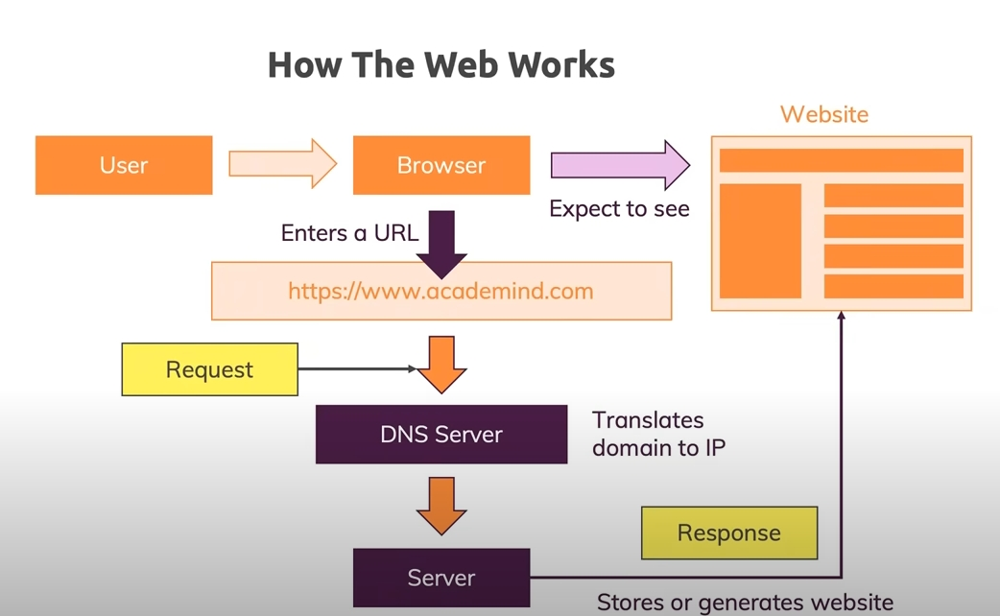
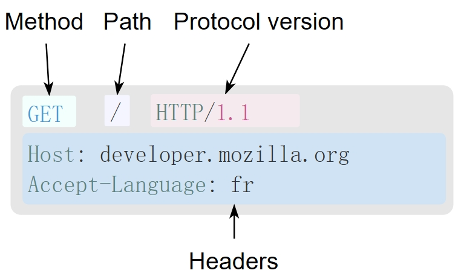
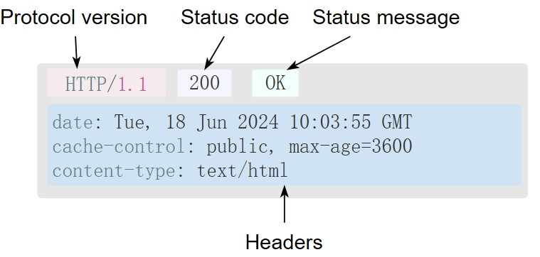
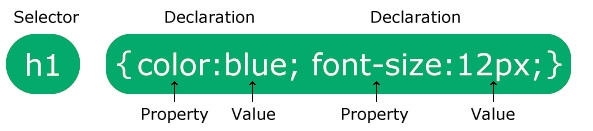
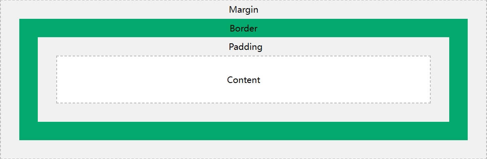
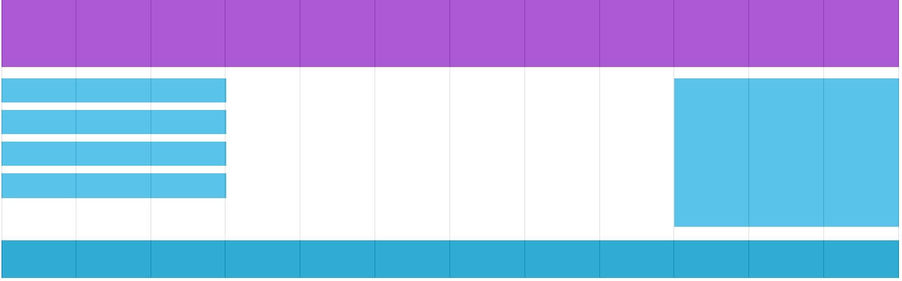

- 1.**How Internet & Websites works**
  collapsed:: true
	- How does the INTERNET work?
		- 9m https://www.youtube.com/watch?v=x3c1ih2NJEg
	- How The Web Works - The Big Picture
		- 12m https://www.youtube.com/watch?v=hJHvdBlSxug
	- How does the internet work? (Full Course)
		- 1h 42m
		- [https://youtu.be/zN8YNNHcaZc](https://youtu.be/zN8YNNHcaZc)
	- https://roadmap.sh/guides/what-is-internet
		- 什么是互联网？
		  collapsed:: true
			- 互相连接的计算机组成的全球网络
			- 通过标准化的协议进行通信
		- 信息如何在互联网上传输？
		  collapsed:: true
			- Internet 上的信息通过各种介质（包括以太网电缆、光纤电缆和无线信号（即无线电波））以比特的形式从一台计算机移动到另一台计算机。
		- 网络如何互相通信，以及其中的协议？
			- IP
				- 电脑的网络地址标识符
			- 域名
				- IP的别名
			- DNS
				- IP和域名的映射表
			-
		- 数据包、路由器和可靠性之间有什么关系？
		  collapsed:: true
			- 数据包
				- 网络上传输的数据包不需要遵循固定路径
				- 数据包可以分成多个小包按不同路径抵达目的地
			- 路由器
				- 包的中转站，控制包的路径选择以及检查包的完整性安全性
			- 可靠性
				- 通过TCP协议保证传输的可靠性
		- HTTP 和 HTML – 您如何在浏览器中查看此网页？
			- {:height 373, :width 592}
		- 互联网上的信息传输如何确保安全？
			- ssl、tls
			- 非对称加密
		- 什么是网络安全，有哪些常见的互联网犯罪？
			- 网络安全是指通过使用网络、技术设备和互联网实现的针对犯罪活动的保护措施
- 2.**Browser/Server request flow, HTTP Protocol, Status codes**
  collapsed:: true
	- HTTP Crash Course & Exploration
		- https://www.youtube.com/watch?v=iYM2zFP3Zn0
		- https://developer.mozilla.org/zh-CN/docs/Web/HTTP
		- HTTP(超文本传输协议)
		  collapsed:: true
			- 是一个用于传输超媒体文档（例如 HTML）的[应用层]协议
			- Web浏览器与Web服务器之间通信而设计的
			- 客户端-服务端模型
			- 无状态协议，服务器不会再两个请求之间保留任何数据（状态）
		- HTTP能控制什么
		  collapsed:: true
			- 缓存
			- 开放同源限制
			- 认证
			- 代理服务器和隧道
			- 会话
		- HTTP流
		  collapsed:: true
			- 1.打开一个 TCP 连接
				- TCP 连接被用来发送一条或多条请求，以及接受响应消息。
			- 2.发送一个 HTTP 报文
				- ```http
				  GET / HTTP/1.1
				  Host: developer.mozilla.org
				  Accept-Language: zh
				  ```
			- 3.读取服务端返回的报文信息
				- ```http
				  HTTP/1.1 200 OK
				  Date: Sat, 09 Oct 2010 14:28:02 GMT
				  Server: Apache
				  Last-Modified: Tue, 01 Dec 2009 20:18:22 GMT
				  ETag: "51142bc1-7449-479b075b2891b"
				  Accept-Ranges: bytes
				  Content-Length: 29769
				  Content-Type: text/html
				  
				  <!DOCTYPE html>…（此处是所请求网页的 29769 字节）
				  ```
			- 4.关闭连接或者为后续请求重用连接
		- HTTP报文
		  collapsed:: true
			- {:height 253, :width 357}
			- HTTP方法
				- GET、POST
			- 要获取的那个资源的路径
			- HTTP 协议版本号
			- 为服务端表达其他信息的可选标头
			- 请求体（body），类似于响应中的请求体，一些像 `POST` 这样的方法，请求体内包含需要了发送的资源。
		- HTTP响应
		  collapsed:: true
			- {:height 231, :width 451}
			- HTTP 协议版本号
			- 状态码
			- 状态信息
			- HTTP标头
			- 可选项
		- HTTP状态码
		  collapsed:: true
			- *1xx 信息性响应* – 请求已接收，正在继续处理
			- *2xx 成功* – 请求已成功接收、理解并接受
			- *3xx 重定向* – 需要采取进一步的措施以完成请求
			- *4xx 客户端错误* – 请求包含语法错误或无法完成
			- *5xx 服务器错误* – 服务器未能完成明显有效的请求
			- **200 OK**
				- 请求已成功，请求所希望的响应头或数据体将随此响应返回。
			- **201 Created**
				- 请求已经被实现，而且有一个新的资源已经依据请求的需要而建立，且其[URI](https://zh.wikipedia.org/wiki/URI)已经随Location头信息返回。
			- **301 Moved Permanently**
				- 被请求的资源已永久移动到新位置，并且将来任何对此资源的引用都应该使用本响应返回的若干个URI之一
			- **301 Found**
				- 要求客户端执行临时重定向，由于这样的重定向是临时的，客户端应当继续向原有地址发送以后的请求。
			- **403 Forbidden**
				- 请求失败，请求所希望得到的资源未被在服务器上发现，但允许用户的后续请求。
			- **404 Not Found**
				- 请求失败，请求所希望得到的资源未被在服务器上发现，但允许用户的后续请求。
			- **401 Unauthorized**
				- 未认证
			- **500 Internal Server Error**
			- **502 Bad Gateway**
- 3.**Basics of HTML/CSS**
	- HTML
	  collapsed:: true
		- 1.什么是HTML
		  collapsed:: true
			- 超文本标记语言
		- 2.什么是HTML Element（元素）
		  collapsed:: true
			- HTML **元素**是从 start 标签到 end 标签的所有内容
		- 3.HTML  Basic
		  collapsed:: true
			- 1.必须声明文档类型`<!DOCTYPE html>`
			- 2.开始于 `<html>`结束于`</html>`
			- 3.`<body>` 和`</body>`之间存放可见部分
			  collapsed:: true
				- ```html
				  <!DOCTYPE html>
				  <html>
				    <body>
				    </body>
				  </html>
				  ```
			- 4.HTML 标题
			  collapsed:: true
				- `<h1>`-`<h6>`
				- `<h1>` 定义最重要的标题。`<h6>` 定义最不重要的标题
			- 5.HTML 段落
			  collapsed:: true
				- `<p>`
			- 6.HTML 链接
			  collapsed:: true
				- `<a>`
				  collapsed:: true
					- _self
					- _blank
					- _parent
					- _top
				- 页面bookmark
					- ```html
					  <h2 id="C4">Chapter 4</h2>
					  <a href="#C4">Jump to Chapter 4</a>
					  ```
			- 7.HTML 图像
			  collapsed:: true
				- ``
				- 源文件 （`src`）、替代文本 （`alt`）、`width` 和 `height` 作为属性提供
			- 8.HTML 水平线
			  collapsed:: true
				- `<hr>`
			- 9.HTML 换行符
			  collapsed:: true
				- `<br>`
			- 10.HTML预格式化文本
			  collapsed:: true
				- `<pre>`
			- 11.Image Maps
			  collapsed:: true
				- ```html
				  
				  <map name="workmap">
				    <area shape="rect" coords="34,44,270,350" alt="Computer" href="computer.htm">
				    <area shape="rect" coords="290,172,333,250" alt="Phone" href="phone.htm">
				    <area shape="circle" coords="337,300,44" alt="Coffee" href="coffee.htm">
				  </map>
				  ```
			- collapsed:: true
			  12. <picture>
				- `<picture>` 元素允许您为不同的设备或屏幕大小显示不同的图片
				- ```html
				  <picture>
				    <source media="(min-width: 650px)" srcset="img_food.jpg">
				    <source media="(min-width: 465px)" srcset="img_car.jpg">
				    
				  </picture>
				  ```
			- 13.favicon
			  collapsed:: true
				- ```html
				  <link rel="icon" type="image/x-icon" href="/images/favicon.ico">
				  ```
			- 14.HTML Title
			  collapsed:: true
				- `<title>`
		- 4.HTML 属性
		  collapsed:: true
			- 属性提供HTML元素的附加信息，所有 HTML 元素都可以具有**属性**
			- `href` 属性指定链接指向的页面的 URL
			- `src` 属性指定要显示的图像的路径
			- `style` 属性用于向元素添加样式，例如颜色、字体、大小等
			- `title` 属性定义有关元素的一些额外信息
		- 5.HTML 样式
		  collapsed:: true
			- HTML `style` 属性用于向元素添加样式，例如颜色、字体、大小等
			- `<tagname  style="property:value;">`
		- 6.HTML 文本格式
		  collapsed:: true
			- `<b>` - 粗体文本不带重要性
			- `<strong>` - 重要文本
			- `<i>` - 斜体文本
			- `<em>` - 强调的文本
			- `<mark>` - 已标记的文本
			- `<small>` - 文本较小
			- `<del>` - 已删除文本
			- `<ins>` - 插入的文本
			- `<sub>` - 下标文本
			- `<sup>` - 上标文本
		- 7.HTML 引用
		  collapsed:: true
			- `<blockquote>` 元素定义从其他来源引用的章节
			- `<q>` 标记定义简短的引用，加引号
			- `<abbr>` 标签定义缩写或首字母缩略词
			- `<address>` 标签定义文档或文章的作者/所有者的联系信息
			- `<cite>` 标签定义了创意作品的标题
			- `<bdo>` 标签用于覆盖当前文本方向
		- 8.HTML 注释
		  collapsed:: true
			- ```html
			  <!-- Write your comments here -->
			  ```
		- 9.HTML 颜色
		  id:: 6743ca50-bb7a-4007-b0d5-008605482356
		  collapsed:: true
			- RGB
				- `rgb(255, 99, 71)`
			- HEX
				- `#ff6347`
			- HSL
				- `hsl(9, 100%, 64%)`
		- 10.HTML CSS
		  collapsed:: true
			- **内联** - 通过在 HTML 元素中使用 `style` 属性
			- **内部** - 通过在 `<head> 部分中使用 <style>` 元素
			- **外部** - 通过使用 `<link>` 元素链接到外部 CSS 文件
		- 11.HTML Tables
		  collapsed:: true
			- `<td>`
				- Table Cells
			- `<tr>`
				- Table rows
			- `<th>`
				- Table Headers
			- `:nth-child(even)`
				- ```css
				  tr:nth-child(even) {
				    background-color: #D6EEEE;
				  }
				  ```
		- 12.HTML Lists
		  collapsed:: true
			- `<ul>`
				- 无序列表
			- `<ol>`
				- 有序列表
			- `<dl>`
				- 描述列表
		- 13.HTML Block and Inline Elements
		  collapsed:: true
			- block
				- `<p>`、`<div>`、`<nav>`...
			- inline
				- `<span>`、`<a>`...
		- 14.HTML  DIV\CLASS\ID
		  collapsed:: true
			- `<div>`、`<div class="classname">`、`<div id="idname">`
		- 15.HTML Iframes
		  collapsed:: true
			- ```html
			  <iframe src="url" title="description"></iframe>
			  ```
		- 16.HTML Responsive Web Design
		  collapsed:: true
			- Setting The Viewport
			  collapsed:: true
				- ```html
				  <meta name="viewport" content="width=device-width, initial-scale=1.0">
				  ```
			- css width
			  collapsed:: true
				- ```html
				  
				  ```
			- <picture>
			- `vw`、`vh`
			- Media Queries
			  collapsed:: true
				- ```CSS
				  /* The width is 100%, when the viewport is 800px or smaller */
				  @media screen and (max-width: 800px) {
				    .left, .main, .right {
				      width: 100%; 
				    }
				  }
				  ```
			- Framework
				- Bootstrap...
		- 17.语义化HTML
		  collapsed:: true
			- `<header>` - 定义文档或章节的页眉
			- `<nav>` - 定义一组导航链接
			- `<section>` - 定义文档中的节
			- `<article>` - 定义独立的自包含内容
			- `<aside>` - 定义内容以外的内容（如侧边栏）
			- `<footer>` - 定义文档或部分的页脚
			- `<details>` - 定义用户可按需打开和关闭的其他详细信息
			- `<summary>` - 定义 `<details>` 元素的标题
			- 
		- 18.HTML 样式指导
		  collapsed:: true
			- 1.始终将文档类型声明为文档中的第一行
			- 2.使用小写元素名称
			- 3.关闭所有 HTML 元素
			- 4.使用小写属性名称
			- 5.始终引用属性值
			- 6.始终为图像指定 `alt` 属性
		- 19.HTML 实体符号
		  collapsed:: true
			- `空格`-`&nbsp;`
			- `<` - `&lt;`
			- `>` - `&gt;`
			- `©` - `&copy;`
		- 20.HTML charset
		  collapsed:: true
			- ```html
			  <meta charset="UTF-8">
			  ```
		- 21.HTML URL ENCODE
		  collapsed:: true
			- url在地址栏里面经过编码
		- 22.HTML Forms
		  collapsed:: true
			- `<form>`
			  collapsed:: true
				- `action`
				- `method`
				- `autocomplete`
			- <form> elements
			  collapsed:: true
				- `<input>`
				- `<label>`
				- `<select>`
				- `<textarea>`
				- `<button>`
				- `<fieldset>`
				- `<legend>`
				- `<datalist>`
					- 预定于选项
				- `<output>`
				- `<option>`
				- `<optgroup>`
			- input type
				- `<input type="button">`
				- `<input type="checkbox">`
				- `<input type="color">`
				- `<input type="date">`
				- `<input type="datetime-local">`
				- `<input type="email">`
				- `<input type="file">`
				- `<input type="hidden">`
				- `<input type="image">`
				- `<input type="month">`
				- `<input type="number">`
				- `<input type="password">`
				- `<input type="radio">`
				- `<input type="range">`
				- `<input type="reset">`
				- `<input type="search">`
				- `<input type="submit">`
				- `<input type="tel">`
				- `<input type="text">`
				- `<input type="time">`
				- `<input type="url">`
				- `<input type="week">`
			-
	- CSS
		- 1.CSS describes how HTML elements should be displayed
		- 2.基本语法
		  collapsed:: true
			- 
		- 3.选择器
		  collapsed:: true
			- 1.简单选择器
			  collapsed:: true
				- 元素名称
				- id选择器
					- id在页面内是唯一的
				- class
				- 通用选择期
					- ```css
					  *{
					    test-align:center;
					  }
					  ```
				- 分组选择器
					- ```css
					  h1, h2, p{
					    color:res;
					  }
					  ```
			- 2.组合选择器
			  collapsed:: true
				- 元素之间特定关系
			- 3.伪类选择器
			  collapsed:: true
				- 根据某种状态
			- 4.伪元素选择器
			  collapsed:: true
				- 选择元素的一部分并为其设置样式
		- 4.添加CSS方式
		  collapsed:: true
			- 外部css
			  collapsed:: true
				- ```html
				  <link rel="stylesheet" href="mystyle.css">
				  ```
			- 内部css
			  collapsed:: true
				- ```html
				  <style>
				    body{
				      background:red;
				    }
				  </style>
				  ```
			- 内联css
			  collapsed:: true
				- ```html
				  <p style="color:red;">This is a paragraph.</p>
				  ```
			- 级联顺序
			  collapsed:: true
				- 内联css具有最高优先权
				- 内部css和外部css按页面加载最后面的优先权越高
		- 5.CSS注释
		  collapsed:: true
			- ```css
			  /*this is a signle-line comment*/
			  p {
			    color:red;
			  }
			  ```
		- 6.CSS颜色
		  collapsed:: true
			- {{embed ((6743ca50-bb7a-4007-b0d5-008605482356))}}
			-
		- 7.CSS背景
		  collapsed:: true
			- ```css
			  body {
			     background: #ffffff url("img_tree.png") no-repeat fix top;
			  }
			  /*
			  * background-color
			  * background-image
			  * background-repeat
			  * background-attachment  属性指定背景图像是否应该滚动或固定
			  * background-position
			  */
			  ```
		- 8.CSS边框
		  collapsed:: true
			- ```css
			  p {
			    border：5px solid red;
			    border-radius: 5px;
			  }
			  ```
		- 9.CSS边距
		  collapsed:: true
			- ```css
			  p {
			    margin: 10px 11px 12px 9px;
			    /* 上 右 下 左 */
			  }
			  ```
			- Margin Collapse
				- ```css
				  h1 {
				    margin: 0 0 50px 0;
				  }
				  h2 {
				    margin: 20px 0 0 0;
				  }
				  /*
				  *常识似乎表明 <h1> 和 <h2> 之间的垂直边距总计为 70px (50px + 20px)
				  *但由于边距塌陷，实际边距最终为 50px
				  */
				  ```
		- 10.CSS填充
		  collapsed:: true
			- ```css
			  div {
			    padding: 25px 50px 75px 100px;/*上右下左*/
			  }
			  /*padding 占据宽度，可以使用box-sizing*/
			  div {
			    width:300px;
			    padding:25px;
			    box-sizing:border-box;
			  }
			  ```
		- 11.CSS   Height, Width and Max-width
		- 12.CSS盒子模型
		  background-color:: red
		  collapsed:: true
			- {:height 233, :width 687}
		- 13.CSS outline
		- 14.CSS 文本
		  collapsed:: true
			- `color`
			- `text-align`、`text-align-last`
			- `direction`
			- `vertical-align`
			- `text-decoration: none;`
			- `text-transform`
			  collapsed:: true
				- 文本字母大小写转换
			- `text-indent`           文本缩进
			- `letter-spacing`   字母间距
			- `line-height` 行高
			- `word-spacing` 字间距
			- `white-space` 文本换行
			- `text-shadow`文本阴影
			-
		- 15.CSS 字体
		  collapsed:: true
			- `font-family`
			- ```css
			  p {
			  	font: italic small-caps bold 12px/30px Georgia, serif;
			  }
			  ```
			- `font-style`
				- normal - 正常
				- italic - 斜体
				- oblique - 倾斜的
			- `font-weight`
				- normal -正常
				- bold - 黑体
			- `font-variant`
				- 小型大写字体
			- `font-size`
				- px
				- em
					- em = 像素/16
				- vw
					- vw 视口宽度
		- 16.CSS 链接
		  collapsed:: true
			- ```css
			  a {
			    color:red;
			  }
			  /*
			  * a:link - 正常的、未访问的链接
			  * a:visited - 用户访问过的链接
			  * a:hover - 当用户将鼠标悬停在链接上时出现的链接
			  * a:active - 单击后立即生成链接
			  */
			  ```
		- 17.CSS 列表
		  collapsed:: true
			- 有序列表
				- `ol`
			- 无序列表
				- `ul`
		- 18.CSS 布局
		  background-color:: red
		  collapsed:: true
			- 块级元素：从新行开始并占据可用全部宽度
			- `display`
			- | Value | Description |
			  | inline | Displays an element as an inline element |
			  | block | Displays an element as a block element |
			  | contents | Makes the container disappear, making the child elements children of the element the next level up in the DOM |
			  | flex | Displays an element as a block-level flex container |
			  | grid | Displays an element as a block-level grid container |
			  | inline-block | Displays an element as an inline-level block container. The element itself is formatted as an inline element, but you can apply height and width values |
			  | inline-flex | Displays an element as an inline-level flex container |
			  | inline-grid | Displays an element as an inline-level grid container |
			  | inline-table | The element is displayed as an inline-level table |
			  | list-item | Let the element behave like a <li> element |
			  | run-in | Displays an element as either block or inline, depending on context |
			  | table | Let the element behave like a <table> element |
			  | table-caption | Let the element behave like a <caption> element |
			  | table-column-group | Let the element behave like a <colgroup> element |
			  | table-header-group | Let the element behave like a <thead> element |
			  | table-footer-group | Let the element behave like a <tfoot> element |
			  | table-row-group | Let the element behave like a <tbody> element |
			  | table-cell | Let the element behave like a <td> element |
			  | table-column | Let the element behave like a <col> element |
			  | table-row | Let the element behave like a <tr> element |
			  | none | The element is completely removed |
			  | initial | Sets this property to its default value |
			  | inherit | Inherits this property from its parent element |
		- 19.CSS 位置
		  background-color:: red
		  collapsed:: true
			- `position`属性指定用于元素的定位方法的类型（静态、相对、固定、绝对或粘性）
			- `static`
				- 静态定位元素不受 top、bottom、left、right 属性的影响。
			- `relative`
				- 相对于其正常位置定位
			- `fixed`
				- 相对于视口定位，这意味着即使页面滚动，它也始终保持在同一位置。
			- `absolute`
				- 相对于最近定位的祖先定位（而不是相对于视口定位，如固定）
			- `sticky`
				- 根据用户的滚动位置定位
		- 20.CSS z-index
		  collapsed:: true
			- `z-index`属性指定元素的堆栈顺序（哪个元素应放置在其他元素的前面或后面）
		- 21.CSS -overflow
		  collapsed:: true
			- `overflow`属性指定当元素的内容太大而无法容纳指定区域时是否剪切内容或添加滚动条
			- `visible` - 默认。溢出不会被剪裁。内容呈现在元素框之外
			- `hidden` - 溢出被剪裁，其余内容将不可见
			- `scroll` - 溢出被剪掉，并添加滚动条以查看其余内容
			- `auto` - 与`scroll`类似，但仅在必要时添加滚动条
		- 22.CSS 浮动
		  background-color:: red
		  collapsed:: true
			- `float`属性指定元素应如何浮动
				- `left` - 元素浮动到其容器的左侧
				- `right` - 元素浮动到其容器的右侧
				- `none` - 元素不浮动（将仅显示在文本中出现的位置）
				- `inherit` - 元素继承其父元素的浮点值
			- `clear`属性指定哪些元素可以浮动在已清除元素旁边以及在哪一侧
				- `none` - 元素不会被推到左或右浮动元素下方
				- `left` - 元素被推到左浮动元素下方
				- `right` - 元素被推到右浮动元素下方
				- `both` - 元素被推到左浮动元素和右浮动元素下方
				- `inherit` - 元素从其父元素继承明确的值
			-
		- 23.CSS 垂直水平居中
		  collapsed:: true
			- ```css
			  /*padding text-align:center*/
			  .center {
			    padding: 70px 0;
			    border: 3px solid green;
			    text-align: center;
			  }
			  /*使用line-height属性，其值等于height属性*/
			  .center {
			    line-height: 200px;
			    height: 200px;
			    border: 3px solid green;
			    text-align: center;
			  }
			  /* If the text has multiple lines, add the following: */
			  .center p {
			    line-height: 1.5;
			    display: inline-block;
			    vertical-align: middle;
			  }
			  
			  /*使用位置变换 使用定位和transform属性 */
			  .center {
			    height: 200px;
			    position: relative;
			    border: 3px solid green;
			  }
			  .center p {
			    margin: 0;
			    position: absolute;
			    top: 50%;
			    left: 50%;
			    transform: translate(-50%, -50%);
			  }
			  /*Flexbox*/
			  .center {
			    display: flex;
			    justify-content: center;
			    align-items: center;
			    height: 200px;
			    border: 3px solid green;
			  }  
			  ```
		- 24.CSS 组合器
		  collapsed:: true
			- （空格）
				- 后代组合器
			- >
				- 子组合器
			- +
				- 下一个同级组合器
				- 用于选择紧接在另一个特定元素之后的元素
			- ~
				- 后续兄弟组合器
				- 选择指定元素的下一个同级元素的所有元素
		- 25.CSS 伪类
		  collapsed:: true
			- 定义元素的特殊状态
				- 当用户将鼠标移到元素上时设置元素的样式
				- 访问过的链接和未访问过的链接的样式不同
				- 当元素获得焦点时设置其样式
				- 样式有效/无效/必需/可选表单元素
		- 26.CSS伪元素
		  collapsed:: true
			- 设置元素的第一个字母或行的样式
			- 在元素之前或之后插入内容
			- 设置列表项标记的样式
			- 为对话框后面的视图框设置样式
			- ```css
			  h1::before {
			    content: url(smiley.gif);
			  }
			  h1::after {
			    content: url(smiley.gif);
			  }
			  ```
		- 27.CSS透明度
		  collapsed:: true
			- ```css
			  img {
			    opacity: 0.5;
			  }
			  ```
		- 28.CSS特异性
		  collapsed:: true
			- 特异性层次
				- **内联样式**- 示例：<h1 style="color: Pink;">
					- 1000分
				- **ID** - 示例：\#navbar
					- 100分
				- **类、伪类、属性选择器**- 示例：.test、:hover、[href]
					- 10分
				- **元素和伪元素**- 示例：h1, ::before
					- 1分
		- 29.CSS `!important`
		  collapsed:: true
			- 用于增加属性/值的重要性
			- 使用`!important`规则，它将覆盖该元素上该特定属性的所有先前样式规则！
		- 30.CSS Flexbox
		  background-color:: red
		  collapsed:: true
			- 可以参考
				- https://www.ruanyifeng.com/blog/2015/07/flex-grammar.html
				- https://www.ruanyifeng.com/blog/2015/07/flex-examples.html
			- 在flexbox之前有四种布局模式
			  collapsed:: true
				- Block, for sections in a webpage
				- Inline, for text
				- Table, for two-dimensional table data
				- Positioned, for explicit position of an element
			- 1.flex容器
			  collapsed:: true
				- 1.方向换行属性
				  collapsed:: true
					- 简写
						- `flex-flow: row wrap;`
					- `flex-direction`
					  collapsed:: true
						- 属性定义容器想要堆叠弹性项目的方向
						- ```css
						  /*从上到下*/
						  .flex-container {
						    display: flex;
						    flex-direction: column;
						  }
						  /*从下到上*/
						  .flex-container {
						    display: flex;
						    flex-direction: column-reverse;
						  }
						  /*从左至右*/
						  .flex-container {
						    display: flex;
						    flex-direction: row;
						  }
						  /*从右至左*/
						  .flex-container {
						    display: flex;
						    flex-direction: row-reverse;
						  }
						  ```
					- `flex-wrap`
					  collapsed:: true
						- 指定 Flex 项目是否应该换行
						- ```css
						  /*必要的时候正常方向换行*/
						  .flex-container {
						    display: flex;
						    flex-wrap: wrap;
						  }
						  /*必要的时候相反方向换行*/
						  .flex-container {
						    display: flex;
						    flex-wrap: wrap-reverse;
						  }
						  /*不会换行（默认）*/
						  .flex-container {
						    display: flex;
						    flex-wrap: nowrap;
						  }
						  ```
				- 2.主轴（通常水平）    对齐item属性
				  collapsed:: true
					- ```css
					  /*center值将弹性项目对齐到容器的中心*/
					  .flex-container {
					    display: flex;
					    justify-content: center;
					  }
					  /*flex-start值将弹性项目对齐到容器的开头*/
					  .flex-container {
					    display: flex;
					    justify-content: flex-start;
					  }
					  /*flex-end值将弹性项目对齐到容器的结尾*/
					  .flex-container {
					    display: flex;
					    justify-content: flex-end;
					  }
					  /* space-around 值显示Flex 项目，并在行前、行间和行后留有空格*/
					  .flex-container {
					    display: flex;
					    justify-content: space-around;
					  }
					  /*space-between值显示弹性项目，行之间有空格*/
					  .flex-container {
					    display: flex;
					    justify-content: space-between;
					  }
					  ```
				- 3.交叉轴（通常垂直）对齐item属性
				  collapsed:: true
					- ```css
					  /*center值将弹性项目对齐在容器的中间*/
					  .flex-container {
					    display: flex;
					    height: 200px;
					    align-items: center;
					  }
					  /*flex-start值将弹性项目对齐到容器的顶部*/
					  .flex-container {
					    display: flex;
					    height: 200px;
					    align-items: flex-start;
					  }
					  /*flex-end值将弹性项目对齐到容器的底部*/
					  .flex-container {
					    display: flex;
					    height: 200px;
					    align-items: flex-end;
					  }
					  /*stretch值拉伸弹性项目以填充容器（这是默认值）*/
					  .flex-container {
					    display: flex;
					    height: 200px;
					    align-items: baseline;
					  }
					  ```
				- 4.对齐内容属性
				  collapsed:: true
					- 通常用于多行布局，用来控制这些行在交叉轴上的位置
					- ```css
					  /*space-between值在行之间均匀分配空间，第一个行和最后一个行对齐容器的两端，其他行在它们之间均匀分布。*/
					  .flex-container {
					    display: flex;
					    height: 600px;
					    flex-wrap: wrap;
					    align-content: space-between;
					  }
					  /*space-around值在行之间均匀分配空间，但行之间的间隔相等，两端的间隔是间隔的 1/2*/
					  .flex-container {
					    display: flex;
					    height: 600px;
					    flex-wrap: wrap;
					    align-content: space-around;
					  }
					  /*stretch值行会拉伸以填充整个容器（这是默认值）*/
					  .flex-container {
					    display: flex;
					    height: 600px;
					    flex-wrap: wrap;
					    align-content: stretch;
					  }
					  /*center值将所有的行居中对齐*/
					  .flex-container {
					    display: flex;
					    height: 600px;
					    flex-wrap: wrap;
					    align-content: center;
					  }
					  /*将所有的行对齐到容器的交叉轴起始位置（通常是顶部）*/
					  .flex-container {
					    display: flex;
					    height: 600px;
					    flex-wrap: wrap;
					    align-content: flex-start;
					  }
					  /*将所有的行对齐到容器的交叉轴结束位置（通常是底部）*/
					  .flex-container {
					    display: flex;
					    height: 600px;
					    flex-wrap: wrap;
					    align-content: flex-end;
					  }
					  ```
			- 2.flex项目
				- `order`属性指定弹性项目的顺序
				- `flex-grow`属性指定 Flex 项目相对于其余 Flex 项目的增长量
				- `flex-shrink`属性指定 Flex 项目相对于其余 Flex 项目收缩的程度
				- `flex-basis`属性指定弹性项目的初始长度
				- 简写
				  collapsed:: true
					- `style="flex: 0 0 200px"`
					- Flex 项目不可增长 (0)、不可收缩 (0)，且初始长度为 200 像素
				- `align-self`属性指定灵活容器内所选项目的对齐方式
					- `align-self: center`、`align-self: start`、`align-self: end`
				-
		- 31.CSS 响应式网页布局
		  background-color:: red
			- 1.设置Viewport
			  collapsed:: true
				- `<meta name="viewport" content="width=device-width, initial-scale=1.0">`
			- 2.根据视口调整内容大小
			  collapsed:: true
				- **1. 不要使用大的固定宽度元素**
				- **2. 不要让内容依赖于特定视口宽度来良好渲染**
				- **3. 使用CSS媒体查询为小屏幕和大屏幕应用不同的样式**
			- 3.网格视图
			  collapsed:: true
				- 在设计网页时使用网格视图非常有帮助。它使在页面上放置元素变得更加容易
				- 响应式网格视图通常有 12 列，总宽度为 100%，并且会随着您调整浏览器窗口的大小而缩小和扩展
				- 1.确保所有 HTML 元素的`box-sizing`属性设置为`border-box`
					- 这可确保内边距和边框包含在元素的总宽度和高度中
					- ```css
					  * {
					    box-sizing: border-box;
					  }
					  ```
				- 2.为每一列创建一个类`class="col-"`
					- ```css
					  .col-1 {width: 8.33%;}
					  .col-2 {width: 16.66%;}
					  .col-3 {width: 25%;}
					  .col-4 {width: 33.33%;}
					  .col-5 {width: 41.66%;}
					  .col-6 {width: 50%;}
					  .col-7 {width: 58.33%;}
					  .col-8 {width: 66.66%;}
					  .col-9 {width: 75%;}
					  .col-10 {width: 83.33%;}
					  .col-11 {width: 91.66%;}
					  .col-12 {width: 100%;}
					  ```
				- 3.所有的这些列应该都向左浮动，并具有15px的填充
					- ```css
					  [class*="col-"] {
					    float: left;
					    padding: 15px;
					    border: 1px solid red;
					  }
					  ```
				- 4.每行应包含在`<div>`中。行内的列数加起来应始终为 12
					- ```html
					  <div class="row">
					    <div class="col-3">...</div> <!-- 25% -->
					    <div class="col-9">...</div> <!-- 75% -->
					  </div>
					  ```
				- 5.行内的列全部向左浮动，因此被排除在页面的流程之外，并且其他元素将被放置，就好像这些列不存在一样。为了防止这种情况，我们将添加一个清除流程的样式
					- ```CSS
					  .row::after {
					    content: "";
					    clear: both;
					    display: table;
					  }
					  ```
				- {:height 213, :width 656}
				- 6.利用媒体查询当浏览器窗口小于768px的时候，每列的宽度应该为100%
					- ```css
					  @media only screen and (max-width: 768px) {
					    /* For mobile phones: */
					    [class*="col-"] {
					      width: 100%;
					    }
					  }
					  ```
			- 4.媒体查询
				- 当符合特定条件的时候，`@media`规则包含的css属性块生效
				- ```css
				  @media only screen and (max-width:600px) {
				    body {
				      background-color:lightblue;
				    }
				  }
				  ```
				- 移动优先，可以考虑在页面大于768px的时候更改
					- ```css
					  /* For mobile phones: */
					  [class*="col-"] {
					    width: 100%;
					  }
					  
					  @media only screen and (min-width: 768px) {
					    /* For desktop: */
					    .col-1 {width: 8.33%;}
					    .col-2 {width: 16.66%;}
					    .col-3 {width: 25%;}
					    .col-4 {width: 33.33%;}
					    .col-5 {width: 41.66%;}
					    .col-6 {width: 50%;}
					    .col-7 {width: 58.33%;}
					    .col-8 {width: 66.66%;}
					    .col-9 {width: 75%;}
					    .col-10 {width: 83.33%;}
					    .col-11 {width: 91.66%;}
					    .col-12 {width: 100%;}
					  }
					  ```
				- 对于介于手机和桌面之间的产品
					- ```css
					  /* For mobile phones: */
					  [class*="col-"] {
					    width: 100%;
					  }
					  
					  @media only screen and (min-width: 600px) {
					    /* For tablets: */
					    .col-s-1 {width: 8.33%;}
					    .col-s-2 {width: 16.66%;}
					    .col-s-3 {width: 25%;}
					    .col-s-4 {width: 33.33%;}
					    .col-s-5 {width: 41.66%;}
					    .col-s-6 {width: 50%;}
					    .col-s-7 {width: 58.33%;}
					    .col-s-8 {width: 66.66%;}
					    .col-s-9 {width: 75%;}
					    .col-s-10 {width: 83.33%;}
					    .col-s-11 {width: 91.66%;}
					    .col-s-12 {width: 100%;}
					  }
					  
					  @media only screen and (min-width: 768px) {
					    /* For desktop: */
					    .col-1 {width: 8.33%;}
					    .col-2 {width: 16.66%;}
					    .col-3 {width: 25%;}
					    .col-4 {width: 33.33%;}
					    .col-5 {width: 41.66%;}
					    .col-6 {width: 50%;}
					    .col-7 {width: 58.33%;}
					    .col-8 {width: 66.66%;}
					    .col-9 {width: 75%;}
					    .col-10 {width: 83.33%;}
					    .col-11 {width: 91.66%;}
					    .col-12 {width: 100%;}
					  }
					  ```
					- 示例
						- ```html
						  <!-- 对于桌面第一第三部分跨3列，中间跨6列-->
						  <!-- 对于手机第一第跨3列，第二部分跨9列，第三部分跨12列-->
						  <div class="row">
						    <div class="col-3 col-s-3">...</div>
						    <div class="col-6 col-s-9">...</div>
						    <div class="col-3 col-s-12">...</div>
						  </div>
						  ```
				- 常见的设备
					- ```css
					  /* Extra small devices (phones, 600px and down) */
					  @media only screen and (max-width: 600px) {...}
					  
					  /* Small devices (portrait tablets and large phones, 600px and up) */
					  @media only screen and (min-width: 600px) {...}
					  
					  /* Medium devices (landscape tablets, 768px and up) */
					  @media only screen and (min-width: 768px) {...}
					  
					  /* Large devices (laptops/desktops, 992px and up) */
					  @media only screen and (min-width: 992px) {...}
					  
					  /* Extra large devices (large laptops and desktops, 1200px and up) */
					  @media only screen and (min-width: 1200px) {...}
					  ```
				- 方向：纵向/横向
				  collapsed:: true
					- ```css
					  @media only screen and (orientation: landscape) {
					    body {
					      background-color: lightblue;
					    }
					  }
					  ```
				- 隐藏元素
				  collapsed:: true
					- ```css
					  /* If the screen size is 600px wide or less, hide the element */
					  @media only screen and (max-width: 600px) {
					    div.example {
					      display: none;
					    }
					  }
					  ```
				- 改变字体大小
					- ```css
					  /* If the screen size is 601px or more, set the font-size of <div> to 80px */
					  @media only screen and (min-width: 601px) {
					    div.example {
					      font-size: 80px;
					    }
					  }
					  
					  /* If the screen size is 600px or less, set the font-size of <div> to 30px */
					  @media only screen and (max-width: 600px) {
					    div.example {
					      font-size: 30px;
					    }
					  }
					  ```
			- 5.图片
			  collapsed:: true
				- ```css
				  img {
				    max-width: 100%;
				    height: auto;
				  }
				  /*大图像在大计算机屏幕上可能很完美，但在小设备上毫无用处*/
				  /* For width smaller than 400px: */
				  body {
				    background-image: url('img_smallflower.jpg');
				  }
				  /* For width 400px and larger: */
				  @media only screen and (min-width: 400px) {
				    body {
				      background-image: url('img_flowers.jpg');
				    }
				  }
				  ```
				- ```html
				  <!--<picture>元素为 Web 开发人员指定图像资源提供了更大的灵活性-->
				  <picture>
				    <source srcset="img_smallflower.jpg" media="(max-width: 400px)">
				    <source srcset="img_flowers.jpg">
				    
				  </picture>
				  ```
			- 6.视频
				- ```css
				  video {
				    max-width: 100%;
				    height: auto;
				  }
				  ```
		- 32.CSS Grid
		  background-color:: red
		  collapsed:: true
			- ```css
			  .grid-container {
			    display: grid;
			  }
			  .grid-container {
			    display: inline-grid;
			  }
			  ```
			- `column-gap` 列间隔
			- `row-gap` 行间隔
			- `gap` 全部间隔
			- 列线和行线
			  collapsed:: true
				- ```css
				  .item1 {
				    grid-column-start: 1;
				    grid-column-end: 3;
				  }
				  .item1 {
				    grid-row-start: 1;
				    grid-row-end: 3;
				  }
				  ```
			- 网格容器
				- `grid-template-columns`属性定义网格布局中的列数，并且可以定义每列的宽度。
				- ```css
				  .grid-container {
				    display: grid;
				    grid-template-columns: auto auto auto auto;
				  }
				  .grid-container {
				    display: grid;
				    grid-template-columns: 80px 200px auto 40px;
				  }
				  ```
				- `grid-template-rows`属性定义每行的高度
				  collapsed:: true
					- ```css
					  .grid-container {
					    display: grid;
					    grid-template-rows: 80px 200px;
					  }
					  ```
				- `justify-content`属性用于对齐容器内的整个网格
				  collapsed:: true
					- ```css
					  .grid-container {
					    display: grid;
					    justify-content: space-evenly;
					  }
					  .grid-container {
					    display: grid;
					    justify-content: space-between;
					  }
					  .grid-container {
					    display: grid;
					    justify-content: center;
					  }
					  ```
				- `align-content`属性用于*垂直*对齐容器内的整个网格。
				  collapsed:: true
					- ```css
					  .grid-container {
					    display: grid;
					    height: 400px;
					    align-content: center;
					  }
					  .grid-container {
					    display: grid;
					    height: 400px;
					    align-content: space-evenly;
					  }
					  .grid-container {
					    display: grid;
					    height: 400px;
					    align-content: space-around;
					  }
					  .grid-container {
					    display: grid;
					    height: 400px;
					    align-content: space-between;
					  }
					  ```
				- `grid-column`属性定义在哪一列上放置项目
				  collapsed:: true
					- `grid-column`属性是`grid-column-start`和`grid-column-end`属性的简写属性
					- ```css
					  .item1 {
					    grid-column: 1 / 5;
					  }
					  .item2 {
					    grid-column: 2 / span 3;
					  }
					  ```
				- `grid-row`属性定义将项目放置在哪一行
				  collapsed:: true
					- `grid-row`属性是`grid-row-start`和`grid-row-end`属性的简写属性
					- ```css
					  .item1 {
					    grid-row: 1 / 4;
					  }
					  .item1 {
					    grid-row: 1 / span 2;
					  }
					  ```
				- `grid-area`属性可以用作 `grid-row-start` 、 `grid-column-start` 、 `grid-row-end`和`grid-column-end`属性
					- ```css
					  .item8 {
					    grid-area: 1 / 2 / 5 / 6;
					  }
					  .item8 {
					    grid-area: 2 / 1 / span 2 / span 3;
					  }
					  ```
		- 33.SASS
			- CSS预处理器
			- SASS减少了CSS重复，因此节省了时间
- 4.**Basics of JavaScript**
  collapsed:: true
	- https://zh.javascript.info/
	- 1.什么是javascript
	  collapsed:: true
		- 开始是专门为浏览器设计的一门语言，但是现在也被用于很多其他的环境
		- 与 HTML/CSS 完全集成
	- 2.手册和规范
	  collapsed:: true
		- 1.javascript参考
			- https://developer.mozilla.org/zh-CN/docs/Web/JavaScript/Reference
		- 2.兼容性列表
			- https://caniuse.com/
			- https://compat-table.github.io/compat-table/es6/
	- 3.javascript基础知识
		- Hello world!
		  collapsed:: true
			- `<script>`标签
			  collapsed:: true
				- ```js
				  <script>
				    alert('hello world!');
				  </script>
				  ```
			- 外部脚本
			  collapsed:: true
				- `<script src="/path/to/script.js"></script>`
			- `type` 和 `language` 特性（attribute）不是必需的
		- 代码结构
		  collapsed:: true
			- 分号
				- 即使语句被换行符分隔了，我们依然建议在它们之间加分号
			- 注释
				- **单行注释以两个正斜杠字符 `//` 开始**
				- **多行注释以一个正斜杠和星号开始 `“/*”` 并以一个星号和正斜杠结束 `“*/”`**
		- 现代模式，“use strict”
		  collapsed:: true
			- `use strict`明确地激活ES5 规范
			- 放在脚本最顶部
		- 变量
		  collapsed:: true
			- 数据的命名存储
				- 将变量想象成一个“数据”的盒子，盒子上有一个唯一的标注盒子名字的贴纸
			- `let` 关键字创建变量
			- `var` — 老旧的变量声明方式。一般情况下，我们不会再使用它。
			- 变量命名
				- 1.必须仅包含字母、数字、符号 $ 和 _
				- 2.首字母必须非数字
				- 3.区分大小写
				- 4.允许非英文字母，但不推荐
				- 5.保留字
					- 比如 `let`、`class`、`return`、`function`无法做变量名
			- 常量
				- `const`
				- 常量不能被更改
				- 大写还是小写，根据常量在执行之前是否已知
					- ```js
					  const COLOR_RED = "#F00";
					  const pageLoadTime = /*网页加载所需时间*/
					  ```
			-
			-
		- 数据类型
		  collapsed:: true
			- Number 类型
			  collapsed:: true
				- 整数和浮点数
				- `Infinity`
					- 代表无穷大 ∞
				- `NaN`
					- 代表一个计算错误
				-
			- BigInt     类型
			  collapsed:: true
				- 表示任意长度的整数
				- 因为Number类型下，超出安全整数范围 `±(253-1)` 会出现精度问题
				- ```js
				  // 尾部的 "n" 表示这是一个 BigInt 类型
				  const bigInt = 1234567890123456789012345678901234567890n;
				  ```
			- String      类型
			  collapsed:: true
				- 双引号：`"Hello"`
				- 单引号：`'Hello'`
				- 反引号：``Hello``
				  collapsed:: true
					- 反引号是 **功能扩展** 引号。它们允许我们通过将变量和表达式包装在 `${…}` 中，来将它们嵌入到字符串中
					- ```js
					  let str = "Hello";
					  let str2 = 'Single quotes are ok too';
					  let phrase = `can embed another ${str}`;
					  ```
			- Boolean  类型
			  collapsed:: true
				- `true` 和 `false`
			- null 值
			  collapsed:: true
				- `null` 仅仅是一个代表“无”、“空”或“值未知”的特殊值
			- undefined 值
			  collapsed:: true
				- `undefined` 的含义是 `未被赋值`
			- Object类型和Symbol类型
			  collapsed:: true
				- 其他所有的数据类型都被称为“原始类型”，因为它们的值只包含一个单独的内容（字符串、数字或者其他）。相反，`object` 则用于储存数据集合和更复杂的实体。
				- `symbol` 类型用于创建对象的唯一标识符
			- typeof 运算符
			  collapsed:: true
				- 返回参数的类型。
		- 交互：alert、prompt和confirm
		  collapsed:: true
			- **prompt**
				- 显示信息要求用户输入文本。点击确定返回文本，点击取消或按下 Esc 键返回 `null`
			- **confirm**
				- 显示信息等待用户点击确定或取消。点击确定返回 `true`，点击取消或按下 Esc 键返回 `false`。
				-
		- 类型转换
		  collapsed:: true
			- 大多数情况下，运算符和函数会自动将赋予它们的值转换为正确的类型
			- 字符串转换
				- `String(value)`
			- 数字型转换
			  collapsed:: true
				- 在算术函数和表达式中，会自动进行 number 类型转换
				- `Number(value)`
				- 转换规则
					- `undefined` -> `NaN`
					- `null` -> `0`
					- `true`和`false` ->  `1`和`0`
					- `string` -> 去掉首尾空白字符（空格、换行符 `\n`、制表符 `\t` 等）后的纯数字字符串中含有的数字。如果剩余字符串为空，则转换结果为 `0`。否则，将会从剩余字符串中“读取”数字。当类型转换出现 error 时返回 `NaN`
			- 布尔型转换
			  collapsed:: true
				- 直观上为“空”的值（如 `0`、空字符串、`null`、`undefined` 和 `NaN`）将变为 `false`
				- 其他值变成 `true`
		- 基础运算符，数学运算
			- 加法 `+`,
			- 减法 `-`,
			- 乘法 `*`,
			- 除法 `/`,
			- 取余 `%`,
			- 求幂 `**`
			- 运算符优先级
			  collapsed:: true
				- 一元运算符优先级高于二元运算符
			- 自增自减
			  collapsed:: true
				- 前置的会先改变变量值
			- 位运算符
			  collapsed:: true
				- 一般web领域很少用到，在特殊领域如密码学
				- 按位与 ( `&` )
				- 按位或 ( `|` )
				- 按位异或 ( `^` )
				- 按位非 ( `~` )
				- 左移 ( `<<` )
				- 右移 ( `>>` )
				- 无符号右移 ( `>>>` )
				-
			- 逗号运算符
			  collapsed:: true
				- 很少使用，且优先级非常低
				- 但这样的技巧在许多 JavaScript 框架中都有使用
					- ```js
					  // 一行上有三个运算符
					  for (a = 1, b = 3, c = a * b; a < 10; a++) {
					   ...
					  }
					  ```
		-
-