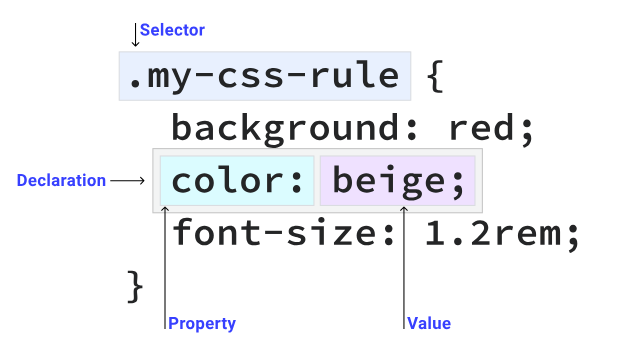

- 1.**[How Internet & Websites works](https://github.com/thecodeholic/php-developer-roadmap#how-internet--websites-works)**
  collapsed:: true
	- How does the INTERNET work?
		- 9m https://www.youtube.com/watch?v=x3c1ih2NJEg
	- How The Web Works - The Big Picture
		- 12m https://www.youtube.com/watch?v=hJHvdBlSxug
	- How does the internet work? (Full Course)
		- 1h 42m
		- [https://youtu.be/zN8YNNHcaZc](https://youtu.be/zN8YNNHcaZc)
	- https://roadmap.sh/guides/what-is-internet
		- 什么是互联网？
		  collapsed:: true
			- 互相连接的计算机组成的全球网络
			- 通过标准化的协议进行通信
		- 信息如何在互联网上传输？
		  collapsed:: true
			- Internet 上的信息通过各种介质（包括以太网电缆、光纤电缆和无线信号（即无线电波））以比特的形式从一台计算机移动到另一台计算机。
		- 网络如何互相通信，以及其中的协议？
			- IP
				- 电脑的网络地址标识符
			- 域名
				- IP的别名
			- DNS
				- IP和域名的映射表
			-
		- 数据包、路由器和可靠性之间有什么关系？
		  collapsed:: true
			- 数据包
				- 网络上传输的数据包不需要遵循固定路径
				- 数据包可以分成多个小包按不同路径抵达目的地
			- 路由器
				- 包的中转站，控制包的路径选择以及检查包的完整性安全性
			- 可靠性
				- 通过TCP协议保证传输的可靠性
		- HTTP 和 HTML – 您如何在浏览器中查看此网页？
			- {:height 373, :width 592}
		- 互联网上的信息传输如何确保安全？
			- ssl、tls
			- 非对称加密
		- 什么是网络安全，有哪些常见的互联网犯罪？
			- 网络安全是指通过使用网络、技术设备和互联网实现的针对犯罪活动的保护措施
- 2.**[Browser/Server request flow, HTTP Protocol, Status codes](https://github.com/thecodeholic/php-developer-roadmap#browserserver-request-flow-http-protocol-status-codes)**
  collapsed:: true
	- HTTP Crash Course & Exploration
		- https://www.youtube.com/watch?v=iYM2zFP3Zn0
		- https://developer.mozilla.org/zh-CN/docs/Web/HTTP
		- HTTP(超文本传输协议)
		  collapsed:: true
			- 是一个用于传输超媒体文档（例如 HTML）的[应用层]协议
			- Web浏览器与Web服务器之间通信而设计的
			- 客户端-服务端模型
			- 无状态协议，服务器不会再两个请求之间保留任何数据（状态）
		- HTTP能控制什么
		  collapsed:: true
			- 缓存
			- 开放同源限制
			- 认证
			- 代理服务器和隧道
			- 会话
		- HTTP流
		  collapsed:: true
			- 1.打开一个 TCP 连接
				- TCP 连接被用来发送一条或多条请求，以及接受响应消息。
			- 2.发送一个 HTTP 报文
				- ```http
				  GET / HTTP/1.1
				  Host: developer.mozilla.org
				  Accept-Language: zh
				  ```
			- 3.读取服务端返回的报文信息
				- ```http
				  HTTP/1.1 200 OK
				  Date: Sat, 09 Oct 2010 14:28:02 GMT
				  Server: Apache
				  Last-Modified: Tue, 01 Dec 2009 20:18:22 GMT
				  ETag: "51142bc1-7449-479b075b2891b"
				  Accept-Ranges: bytes
				  Content-Length: 29769
				  Content-Type: text/html
				  
				  <!DOCTYPE html>…（此处是所请求网页的 29769 字节）
				  ```
			- 4.关闭连接或者为后续请求重用连接
		- HTTP报文
		  collapsed:: true
			- {:height 253, :width 357}
			- HTTP方法
				- GET、POST
			- 要获取的那个资源的路径
			- HTTP 协议版本号
			- 为服务端表达其他信息的可选标头
			- 请求体（body），类似于响应中的请求体，一些像 `POST` 这样的方法，请求体内包含需要了发送的资源。
		- HTTP响应
		  collapsed:: true
			- {:height 231, :width 451}
			- HTTP 协议版本号
			- 状态码
			- 状态信息
			- HTTP标头
			- 可选项
		- HTTP状态码
		  collapsed:: true
			- *1xx 信息性响应* – 请求已接收，正在继续处理
			- *2xx 成功* – 请求已成功接收、理解并接受
			- *3xx 重定向* – 需要采取进一步的措施以完成请求
			- *4xx 客户端错误* – 请求包含语法错误或无法完成
			- *5xx 服务器错误* – 服务器未能完成明显有效的请求
			- **200 OK**
				- 请求已成功，请求所希望的响应头或数据体将随此响应返回。
			- **201 Created**
				- 请求已经被实现，而且有一个新的资源已经依据请求的需要而建立，且其[URI](https://zh.wikipedia.org/wiki/URI)已经随Location头信息返回。
			- **301 Moved Permanently**
				- 被请求的资源已永久移动到新位置，并且将来任何对此资源的引用都应该使用本响应返回的若干个URI之一
			- **301 Found**
				- 要求客户端执行临时重定向，由于这样的重定向是临时的，客户端应当继续向原有地址发送以后的请求。
			- **403 Forbidden**
				- 请求失败，请求所希望得到的资源未被在服务器上发现，但允许用户的后续请求。
			- **404 Not Found**
				- 请求失败，请求所希望得到的资源未被在服务器上发现，但允许用户的后续请求。
			- **401 Unauthorized**
				- 未认证
			- **500 Internal Server Error**
			- **502 Bad Gateway**
- 3. Basics of HTML/CSS
	- 语义化HTML
	  collapsed:: true
		- {:height 389, :width 457}
	- CSS
		- CSS规则
		  collapsed:: true
			- {:height 254, :width 421}
		- 盒子模型
		  collapsed:: true
			- 核心基础
			- css显示的所有内容都是一个框
			- 
		- 选择器
		  collapsed:: true
			- 使用 CSS 选择器来查找特定元素，然后应用 CSS 规则
			- 通用选择器
			  collapsed:: true
				- 可以和任何元素匹配
				- ```css
				  * {
				    color: hotpink;
				  }
				  ```
			- 类型选择器
			  collapsed:: true
				- ```css
				  section {
				    padding: 2em;
				  }
				  ```
			- 类选择器
			  collapsed:: true
				- 通过HTML元素的class属性匹配
					- ```css
					  .my-class {
					    color: red;
					  }
					  ```
			- ID选择器
			  collapsed:: true
				- 具有 `id` 属性的 HTML 元素应该是页面上具有该 ID 值的唯一元素
					- ```css
					  #rad {
					    border: 1px solid blue;
					  }
					  ```
			- 属性选择器
			  collapsed:: true
				- 查找具有特定 HTML 属性的元素， 或具有某个 HTML 属性的特定值
					- ```css
					  [data-type='primary'] {
					    color: red;
					  }
					  /* A href that contains "example.com" */
					  [href*='example.com'] {
					    color: red;
					  }
					  
					  /* A href that starts with https */
					  [href^='https'] {
					    color: green;
					  }
					  
					  /* A href that ends with .com */
					  [href$='.com'] {
					    color: blue;
					  }
					  ```
			- 分组选择器
			  collapsed:: true
				- ```css
				  strong,
				  em,
				  .my-class,
				  [lang] {
				    color: red;
				  }
				  ```
			- 伪类
			  collapsed:: true
				- HTML 元素会各自处于各种状态如点击过，移动过
				  collapsed:: true
					- ```css
					  /* Our link is hovered */
					  a:hover {
					    outline: 1px dotted green;
					  }
					  
					  /* Sets all even paragraphs to have a different background */
					  p:nth-child(even) {
					    background: floralwhite;
					  }
					  ```
			- 伪元素
			  collapsed:: true
				- 伪元素与伪类的不同之处在于，它们不会响应平台状态， 就像使用 CSS 插入新元素一样。
				- ```css
				  .my-element::before {
				    content: 'Prefix - ';
				  }
				  ```
			- 复杂选择器
			  collapsed:: true
				- 后代选择器
					- ```css
					  p strong {
					    color: blue;
					  }
					  ```
				-
		- 级联
		  collapsed:: true
			- 级联是一种用于解决多个 CSS 规则应用于一个 HTML 元素的冲突的算法
			- **位置和显示顺序**：CSS 规则的显示顺序
				- 同一位置，越往后层级越高
				- 内嵌css > 内联css  > 外联css
				- 明确性，越明确定位权重就越高
			- 提高优先级
				- `!important`
		- 特异性
		  collapsed:: true
			- 更具css特异分值来确定最终元素应用哪个css
		- 继承
		  collapsed:: true
			- 有些 CSS 属性会在您未指定值的情况下沿用
		- 颜色
		  collapsed:: true
			- 16进制颜色
				- ```css
				  h1 {
				    color:#00000;
				  }
				  ```
			- RGB(红、绿、蓝)颜色
				- ```css
				  h1 {
				    color: rgb(183, 21, 64);
				  }
				  ```
			- HSL（色相、饱和度、亮度）颜色
				- ```css
				  h1 {
				    color: hsl(344, 79%, 40%);
				  }
				  ```
		- 尺码单位
		  collapsed:: true
			- px，rem ，vw，vh
		- 布局
		  collapsed:: true
			- 
			- 了解display属性
				- `display:inline`
					- 类似与句子中的单词，他们在直线方向上彼此相邻
					- 不能在内联元素上设置显式的 width 和 height。
					- 任何块级 margin 和 padding 都将被周围的元素忽略。
				- `display:block`
					- 块元素会另外起一行
					- 遵循block元素所有外边框
				- `display:flex`
					- 使盒子成为块级盒子，并将其子项转换为 flex 项。
					- 这将启用控制对齐、排序和流的 flex 属性
					- Flexbox 是一种用于一维布局的布局机制。 跨单个轴（水平或垂直）布局。
				- `display:grid`
					- Grid 在很多方面都类似于 **flexbox**，但它旨在控制多轴布局而不是单轴布局（垂直或水平空间）
				- `display:inline-block`
					- 使用 `inline-block` 会得到一个盒子，它具有块级元素的一些特征，但仍然与文本内联。
				- `float`
					- 浮动会影响后续相邻元素的布局，可以在父级元素设置**display： flow-root** 或者后续元素使用clear：both
				- `Positioning`
					- `relative`
						- 根据自身定位
					- `absolute`
						- 将元素从当前文档流分离出来
						- 可以将元素放置在任何你喜欢的位置，在其最近的相对父元素中使用top、right、bottom、left
						- 周围所有内容会重排填充绝对元素留下的剩余空间
					- `fixed`
						- 父元素是根据<html>元素，
					- `sticky`
						- 。使用此值时，当视区滚动经过元素时，它将保持锚定到您设置的 `top`、`right`、`bottom` 和 `left` 值
					- `static`
						- 元素会根据 HTML 中的书写顺序进行排列，遵循标准块级或内联布局规则。
		- Flexbox
			-
		- 网格
		- 逻辑属性
		- 间距
		- 伪元素
		- 伪类
		- 边框
		- 阴影
		- 焦点
		- Z-index和堆叠上下文
		- 函数
		- 渐变
		- 动画
		- 滤镜
		- 混合模式
		- 列表
		- 转场效果
		- 溢出
		- 背景
		- 文字和排版
-