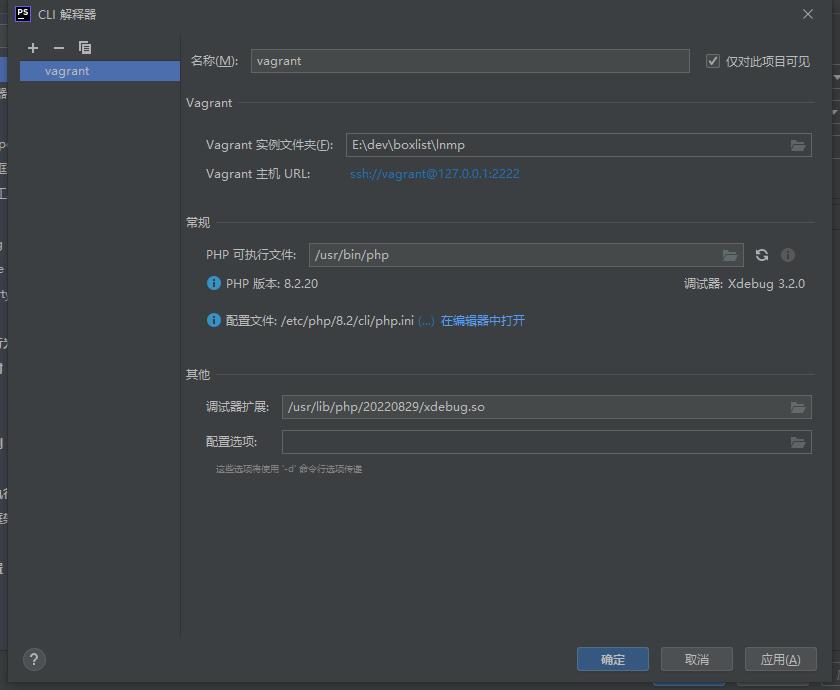
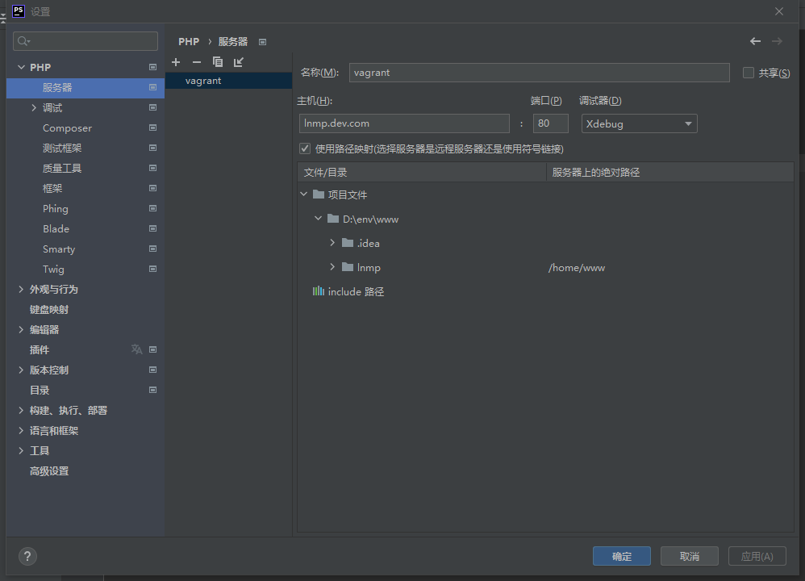
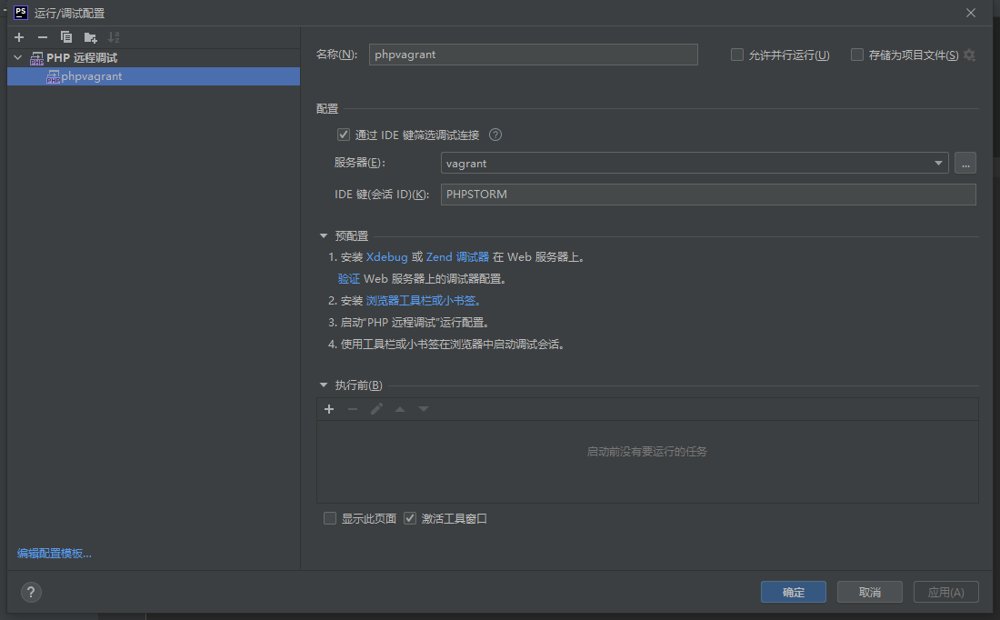

- #php
- 参考链接：https://blog.vgot.net/archives/xdebug3-in-homestead-via-phpstorm-vscode.html
- xdebug3配置安装
- https://xdebug.org/
- step1下载安装xdebug
  collapsed:: true
	- 通过`php -i` 获得的信息填入下面网址，获得合适的安装指南
		- https://xdebug.org/wizard
	- 或者找到对应的安装方式进行安装
		- https://xdebug.org/docs/install
- step2设置xdebug
  collapsed:: true
	- 安装完成后通过`php -i` 查看是否安装成功
	- 通过`php --ini`找到xdebug.ini
		- `/etc/php/8.2/cli/conf.d/20-xdebug.ini`
	- 修改xdebug.ini文件
	  collapsed:: true
		- ```bash
		  zend_extension=xdebug.so
		  xdebug.mode=debug
		  #该功能在 PHP 请求启动时启动，并且在运行任何 PHP 代码之前启动。
		  xdebug.start_with_request=yes
		  #默认端口
		  xdebug.client_port=9003
		  #如何设置可以自动获取客户端ip地址可以多人使用
		  #xdebug.discover_client_host = 1
		  #配置client的ip，可通过ipconfig查看
		  xdebug.client_host=192.168.199.1
		  #配置日志信息注意文件的写入权限
		  xdebug.log=/var/log/xdebug.log
		  #堆栈深度限制
		  xdebug.max_nesting_level = 512
		  #和浏览器插件对应标识符
		  xdebug.idekey = PHPSTORM
		  ```
	- 重启php-fpm
		- ```bash
		  sudo systemctl restart php8.2-fpm
		  ```
- step3配置IDE和浏览器
  collapsed:: true
	- PHPSTORM
		- 文件-设置-PHP-CLI解释器
			- {:height 373, :width 590}
		- 服务器设置文件目录映射
			- 文件-设置-服务器
			- {:height 382, :width 595}
		- 文件-设置-调试
			- xdebug
		- 在右上角的 Debug 工具栏中点击下拉框添加一个配置
			- 配置键值
			- {:height 359, :width 606}
	- SUBLIME
		- https://github.com/Kindari/SublimeXdebug
		- ctrl + shift + p  —> install package -> php debug
		- ```json
		  {
		      "path_mapping": {
		          "/home/www": "D:/env/www/lnmp"
		      },
		      "url": "http://lnmp.dev.com/",
		      "port": 9003,
		      "max_children": 128,
		      "max_data": 1024,
		      "max_depth": 3
		  }
		  ```
	- VSCODE
		- https://marketplace.visualstudio.com/items?itemName=xdebug.php-debug
		- ```json
		          {
		              "name": "Listen for Xdebug on vagrant",
		              "type": "php",
		              "request": "launch",
		              "pathMappings" : {
		                  "/home/www":"D:/env/www/lnmp"
		              },
		              "port": 9003
		          },
		  ```
	- CHROME
		- https://chromewebstore.google.com/detail/xdebug-helper/eadndfjplgieldjbigjakmdgkmoaaaoc
		- 右键选项-IDE key
- step4验证
  collapsed:: true
	- ```php
	  xdebug_info();
	  phpinfo();
	  ```