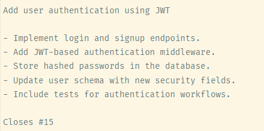

- #git #技术
- 1.学习资料:
  collapsed:: true
	- 官方网站：https://git-scm.com
	- 交互互动：https://learngitbranching.js.org
	- 学习路线：https://roadmap.sh/git-github
- 1.起步
  collapsed:: true
	- 什么是版本控制 ？
		- 记录一个或若干文件内容变化
		- 将来可查阅特定版本修订情况的系统
	- 发展历程
		- 本地版本控制系统->集中化的版本控制系统->分布式版本控制系统
- 2.Git简史
  collapsed:: true
	- Linus Torvalds 因为 BitKeeper 收回于2005年开发
	- Git是什么？
	  collapsed:: true
		- 与其他系统的区别
			- 1.直接记录快照，而非差异比较
			- 2.近乎所有的操作都是本地执行
			- 3.Git保证完整性
			- 4.Git一般只添加数据
	- 三种状态
	  collapsed:: true
		- 已提交（committed）
			- 数据已经安全地保存在本地数据库
		- 已修改（modified）
			- 修改了文件，但还没保存到数据库中
		- 已暂存（staged）
			- 对一个已修改文件的当前版本做了标记，使之包含在下次提交的快照中
	- 工作目录、暂存区域、Git仓库
	  collapsed:: true
		- 工作区是对项目的某个版本独立提取出来的内容
		- 暂存区是一个文件，保存了下次将要提交的文件列表信息，一般在 Git 仓库目录中
		- Git 仓库目录是 Git 用来保存项目的元数据和对象数据库的地方
	- 基本工作流程
	  collapsed:: true
		- 1.在工作区修改文件
		- 2.将你想要下次提交的更改选择性地暂存，这样只会将更改的部分添加到暂存区
		- 3.提交更新，找到暂存区的文件，将快照永久性存储到 Git 目录
	- 初次运行Git前的配置
	  collapsed:: true
		- git config 工具来设置
			- `/etc/gitconfig` 文件
				- 系统级别设置
			- `~/.gitconfig` 或 `~/.config/git/config` 文件
				- 当前用户
			- `.git/config`
				- 该仓库
		- 设置用户名和邮箱
			- ```
			  git config --global user.name "John Doe"
			  git config --global user.email johndoe@example.com
			  #查看配置信息
			  git config --list
			  ```
			-
- 3.Git基础
	- 初始化仓库
	  collapsed:: true
		- ```git
		  git init
		  ```
	- 其他服务器克隆仓库
	  collapsed:: true
		- ```git
		  git clone https://github.com/libgit2/libgit2
		  ```
	- 检查当前状态
	  collapsed:: true
		- ```git
		  git status
		  ```
	- 添加跟踪新文件
		- ```git
		  git add
		  ```
	- 忽略文件
	  collapsed:: true
		- 建立`.gitignore`文件
		- ```
		  # 忽略所有的 .a 文件
		  *.a
		  
		  # 但跟踪所有的 lib.a，即便你在前面忽略了 .a 文件
		  !lib.a
		  
		  # 只忽略当前目录下的 TODO 文件，而不忽略 subdir/TODO
		  /TODO
		  
		  # 忽略任何目录下名为 build 的文件夹
		  build/
		  
		  # 忽略 doc/notes.txt，但不忽略 doc/server/arch.txt
		  doc/*.txt
		  
		  # 忽略 doc/ 目录及其所有子目录下的 .pdf 文件
		  doc/**/*.pdf
		  ```
	- 查看已暂存和未暂存的修改
	  collapsed:: true
		- ```git
		  git status
		  #未暂存的文件更新了哪些部分
		  git diff 
		  #查看已暂存的将要添加到下次提交里的内容
		  git diff --staged
		  git diff --cached
		  ```
	- 提交更新
	  collapsed:: true
		- ```git
		  git commit
		  git commit -m
		  git commit -a # -a 就是git add所有文件了
		  ```
	- 移除文件
	  collapsed:: true
		- ```git
		  git rm * #删除并取消跟踪
		  git rm --cached #取消跟踪但不删除
		  ```
	- 移动文件
	  collapsed:: true
		- ```git
		  git mv file_from file_to
		  相当于运行了下面三个命令
		  mv file_from file_to
		  git rm file_from
		  git add file_to
		  ```
	- 查看历史
	  collapsed:: true
		- ```git
		  git log
		  git log --color --graph --pretty=format:'%Cred%h%Creset -%C(yellow)%d%Creset %s %Cgreen(%cr) %C(bold blue)<%an>%Creset' --abbrev-commit
		  ```
	- 撤销操作
	  collapsed:: true
		- ```GIT
		  git commit --amend
		  #这个命令会将暂存区中的文件提交。 如果自上次提交以来你还未做任何修改（例如，在上次提交后马上执行了此命令）， 那么快照会保持不变，而你所修改的只是提交信息。
		  #下面操作在提交完成后发现还有文件没有提交，可以添加后 git commit --amend，放入到上一次的提交
		  git commit -m 'initial commit'
		  git add forgotten_file
		  git commit --amend
		  ```
	- 取消暂存的文件
	  collapsed:: true
		- ```git
		  git reset HEAD <file>
		  ```
	- 撤销对文件的修改
	  collapsed:: true
		- ```git
		  git checkout -- <file>
		  ```
	- 远程仓库的使用
	  collapsed:: true
		- ```git
		  #查看远程仓库信息
		  git remote
		  #查看远程仓库信息详细
		  git remote -v
		  #查看更加详细的远程仓库信息
		  git remote show <remote>
		  #添加远程仓库
		  git remote add newname https://github.com/xxx/xx
		  #从远程仓库拉取
		  git fetch pb
		  #推送到远程仓库
		  git push <remote> <branch>
		  #查看某个远程仓库
		  git remote show <remote>
		  #远程仓库的重命名和移除
		  git remote rename <remote> <newname>
		  #移除远程仓库
		  git remote remove <remote>
		  ```
	- 打标签
	  collapsed:: true
		- ```git
		  #查看标签
		  git tag
		  
		  #查看指定标签
		  git tag -l “v1.8.5*”
		  
		  #标签分为轻量标签和附注标签
		  #轻量标签很像一个不会改变的分支——它只是某个特定提交的引用。
		  git tag v1.4-lw
		  
		  #附注标签是存储在 Git 数据库中的一个完整对象， 它们是可以被校验的，其中包含打标签者的名字、电子邮件地址、日期时间， 此外还有一个标签信息，并且可以使用 GNU Privacy Guard （GPG）签名并验证。
		  git tag -a v1.0 -m 'my version 1.0'
		  #查看
		  git show v1.4
		  
		  #后期打标签
		  git tag -a v1.2 9fceb02
		  
		  #共享标签
		  git push origin v1.5
		  
		  #一次性推送多个标签
		  git push origin --tags
		  
		  #删除标签
		  git tag -d v1.4-lw
		  #删除远程分支标签
		  git push origin :refs/tags/v1.4-lw
		  git push origin --delete <tagname>
		  
		  #检出标签
		  git checkout 2.0.0
		  ```
	- GIT别名
	  collapsed:: true
		- ```gitbash
		  git config --global alias.co checkout
		  git config --global alias.br branch
		  git config --global alias.ci commit
		  git config --global alias.st status
		  git config --global alias.lg=log --color --graph --pretty=format:'%Cred%h%Creset -%C(yellow)%d%Creset %s %Cgreen(%cr) %C(bold blue)<%an>%Creset' --abbrev-commit
		  ```
- 4.Git分支
	- 定义：
		- 分支（branch）是指项目的一个独立的开发路线，是代码历史的并行版本。
		- 分支是代码的一个指针，指向某个提交（commit）
	- 为什么？
		- 独立开发
			- 可以在一个新分支上进行功能开发或者修复bug，不影响主分支的稳定性
		- 并行工作
			- 团队成员可以在不同分支上工作，最终通过合并（merge）将他们的工作整合在一起
		- 实验和回滚
			- 可以在分支上做一些实验性工作，不满意可以轻松删除分支，不影响其他部分代码
	- 分支的新建与合并
		- ```git
		  #创建并切换到branchname分支
		  git checkout -b branchname
		  #等价于
		  git branch branchname
		  git checkout branchname
		  #合并
		  git checkout master
		  git merge branchname
		  #冲突解决
		  vim flile
		  #手动解决冲突后
		  git add 
		  git commit
		  git merge branchname
		  #删除分支
		  git branch -d branchname
		  ```
	- 分支管理
	  id:: 6705df1f-b60c-48a6-855a-ccad350a5998
	  collapsed:: true
		- ```git
		  #查看分支列表
		  git branch
		  #查看每个分支最新提交
		  git branch -v
		  #查看已经合并和未合并的
		  git branch --merged
		  git branch --no-merged
		  #未被合并的分支删除不掉
		  ```
	- 分支开发工作
	  collapsed:: true
		- 长期分支
			- 使用多个长期分支通常很有帮助
				- master分支   保留完全稳定的代码
				- develop分支  后续开发或者测试稳定性
		- 主题分支
			- 短期分支，用来实现单一特性或者其他工作
	- 远程分支
		- 什么叫远程分支？
			- 指存储在远程仓库中的分支
			- 本地仓库通过 `fetch` 或 `pull` 来获取它们的更新
			- 本地和远程分支之间可以建立追踪关系，从而保持两者的同步
		- 跟踪远程分支
			- 克隆远程仓库
				- 当你首次克隆一个远程仓库时，GIT会自动跟踪分支
			- 创建并跟踪远程分支
				- ```git
				  git checkout -b <local-branch-name> <remote-name>/<remote-branch-name>
				  git checkout -b feature-login origin/feature-login
				  ```
			- 将本地分支与远程分支关联
				- ```git
				  #关联
				  git branch --set-upstream-to <remote-name>/<remote-branch-name>
				  
				  #将本地的 feature-login 分支与 origin/feature-login 关联：
				  git branch --set-upstream-to origin/feature-login
				  
				  #或者
				  git checkout --track origin/feature-login
				  ```
			- 查看跟踪关系
				- ```git
				  git branch -vv
				  ```
			- 拉取
				- ```git
				  #抓取数据，但不修改工作目录
				  git fetch
				  #抓取数据并合并
				  git merge
				  ```
			- 删除
				- ```git
				  git push origin --delete <branchname>
				  ```
	- 分支变基
	  collapsed:: true
		- Git中整合来自不同分支的修改主要两种方法
			- merge
			- rebase
		- 什么叫rebase
			- 将一个分支的变量重新应用到另一个分支的基础之上
			- 通俗的来讲叫做“调整基底”
		- 为什么要使用rebase
			- 保持历史记录的整洁
			- 在合并之前同步分支
		- rebase的风险
			- 如果提交存在于你的仓库之外，而别人可能基于这些提交进行开发，那么不要执行变基
			- 如果你已经将某个分支推送到远程仓库且已经有协作就不要使用rebase
			- 不要对已经共享的提交进行rebase
- 5.服务器上的Git
  collapsed:: true
	- 协议
	  collapsed:: true
		- 本地协议
		- HTTP协议
		- SSH协议
		- Git协议
		-
	- 导出裸版本
		- ```git
		  git clone --bare my_project my_project.git
		  ```
- 6.分布式Git-分布式工作流
  collapsed:: true
	- 集中式工作流
		- 项目有一个主分支，所有的开发者都直接将他们的代码提交到这个分支。
		- 每个开发者首先克隆中央仓库的代码到本地，然后在本地进行开发。
		- 当开发者想要提交工作时，他们会先 **pull** 从远程仓库获取其他开发者的最新更改，然后将自己的更改 **push** 到远程仓库。
	- 集成管理者工作流
		- 1.项目维护者推送到主仓库
		- 2.贡献者克隆此仓库，做出修改
		- 3.贡献者将数据推送到自己的公开仓库
		- 4.贡献者给维护者发送邮件，请求拉取自己的更新
		- 5.维护者在自己本地的仓库中，将贡献者的仓库加为远程仓库并合并修改
		- 6.维护者将合并后的修改推送到主仓库
	- 主管与副主管工作流
		- 1.普通开发者在自己的主题分支上工作，并根据 `master` 分支进行变基。 这里是主管推送的参考仓库的 `master` 分支。
		- 2.副主管将普通开发者的主题分支合并到自己的 `master` 分支中。
		- 3.主管将所有副主管的 `master` 分支并入自己的 `master` 分支中。
		- 4.最后，主管将集成后的 `master` 分支推送到参考仓库中，以便所有其他开发者以此为基础进行变基。
	- 提交准则
		- ```git
		  #step1：检查空白错误
		  git diff --check
		  #step2：尝试每个逻辑上的独立变更集如果改动的式同一个文件可以使用git add --path来部分暂存
		  #step3：提交信息规范模板如下
		  ```
		- 
- 7.github工作流
  collapsed:: true
	- 开源项目
	  collapsed:: true
		- 1.fork副本并克隆到本地
		- 2.创建出名称有意义的分支
		- 3.修改代码
		- 4.检查改动 `git diff --word-diff`
		- 5.将改动提交到分支中
		- 6.将新分支推送到 GitHub 的副本中
		- 7.拉取请求按钮 `Compare & pull request`
		- 8.拉取请求创建页面 `Create pull request`
		- 9.项目拥有者审核，讨论，决定是否合并或拒绝
	- note：如果你和协作者对项目都有写入权限，不必每次都fork项目
	  collapsed:: true
		- 1.你在仓库中创建一个新的分支，例如 `feature/new-login-system`，用于实现登录系统的新功能。
		- 2.在该分支上进行开发和测试
		- 3.完成开发后，你可以在 GitHub 上提交一个拉取请求（Pull Request），将你的 `feature/new-login-system` 分支合并到主分支（如 master）。
		- 4.你的团队成员可以查看、审查你的代码，并在拉取请求中发表评论，讨论任何问题或改进建议。
		- 5.经过审查和测试后，拉取请求被批准，你的分支可以合并到主分支，成为项目的一部分。
	- 拉取请求的进阶用法
	  collapsed:: true
		- 与上游保持同步
			- 1.将源版本库添加为一个远端，并命名为“upstream”（上游）
				- `git remote add upstream https://github.com/schacon/blink`
			- 2.从远端抓取最新的内容
				- `git fetch upstream`
			- 3.将该仓库的主分支的内容合并到你的分支中
				- `git merge upstream/master`
			- 4.修复产生的冲突
				- `vim blink.ino`
			- 5.再推送回同一个分支
				- `git push origin slow-blink`
	- gihub脚本
		- webhook给你提供了一种方式来接收关于在仓库中发生的事件的推送通知
		- GitHub API
- 8.git工具
- 9.其他
	- 同时提交2个不同平台
		- `git remote set-url --add origin https://gitee.com/your-username/your-repo.git`
- 10.Git工具
	- 交互式暂存
		- 当你在修改大量文件后，希望这些改动拆分为若干提交而不是混杂在一起成为一个提交
		- 可以确保提交是逻辑上独立的变更集，同时也会同时使其他开发者与你工作时很容易审核
		- `git add -i`交互暂存
		  collapsed:: true
			- ```gitbash
			  git add -i
			  	   staged    unstaged    path  
			  1:  unchanged      +10/-1    pages/1.md
			  
			  *** Commands ***
			    1: [s]tatus     2: [u]pdate      3: [r]evert     4: [a]dd untracked
			    5: [p]atch      6: [d]iff        7: [q]uit       8: [h]elp
			  ```
		- 如果在`What now>`提示符后键入`u`或者`2`，它会问你想要暂存哪个文件
		  collapsed:: true
			- ```
			  What now> u
			             staged     unstaged path
			    1:    unchanged        +0/-1 TODO
			    2:    unchanged        +1/-1 index.html
			    3:    unchanged        +5/-1 lib/simplegit.rb
			  Update>>
			  ```
		- 要暂存 `TODO` 和 `index.html` 文件，可以输入数字：
		  collapsed:: true
			- ```
			  Update>> 1,2
			             staged     unstaged path
			  * 1:    unchanged        +0/-1 TODO
			  * 2:    unchanged        +1/-1 index.html
			    3:    unchanged        +5/-1 lib/simplegit.rb
			  Update>>
			  ```
		- 每个文件前面的 `*` 意味着选中的文件将会被暂存。 如果在 `Update>>` 提示符后不输入任何东西并直接按回车，Git 将会暂存之前选择的文件：
		  collapsed:: true
			- ```
			  Update>>
			  updated 2 paths
			  - *** Commands ***
			  1: [s]tatus     2: [u]pdate      3: [r]evert     4: [a]dd untracked
			  5: [p]atch      6: [d]iff        7: [q]uit       8: [h]elp
			  What now> s
			           staged     unstaged path
			  1:        +0/-1      nothing TODO
			  2:        +1/-1      nothing index.html
			  3:    unchanged        +5/-1 lib/simplegit.rb
			  ```
		- 现在可以看到 `TODO` 与 `index.html` 文件已经被暂存而 `simplegit.rb` 文件还未被暂存。 如果这时想要取消暂存 TODO 文件，使用 `r` 或 `3`（撤消）选项：
	- 暂存补丁
	- 贮藏与清理
		- 有时候你在项目上工作一段时间后，所有东西进入混沌状态，而这个时候你想要切换到另外一个分支做一点别的事情。
		- 问题是，你不想仅仅因为过会儿回到这一点而为做了一半的工作创建一次提交。
		- `git stash`
			- 贮藏（stash）会处理工作目录的脏的状态——即跟踪文件的修改与暂存的改动——然后将未完成的修改保存到一个栈上， 而你可以在任何时候重新应用这些改动（甚至在不同的分支上）。
	- 签署工作
		- GPG
	- 搜索
		- Git Grep
		- Git 日志搜索
			- git log -S
			- git log -L
	- 重写历史
		- 修改最后一次提交
			- `git commit --amend`
			- 上面这条命令会将最后一次的提交信息载入到编辑器中供你修改。 当保存并关闭编辑器后，编辑器会将更新后的提交信息写入新提交中，它会成为新的最后一次提交。
			- 如果你想要修改最后一次提交的实际内容
				- 首先作出你想要补上的修改， 暂存它们，然后用 `git commit --amend` 以新的改进后的提交来 **替换** 掉旧有的最后一次提交
		- 修改多个提交信息
			- `git rebase -i`
			- ```gitbash
			  git rebase -i HEAD~3
			  #注意不要涉及任何推送到中央服务器的提交
			  ```
	- 重置
	-